The user wants me to revise the architecture document with:
1. More Mermaid diagrams
2. High-level specs
3. Very few pseudo-code snippets
4. Focus on components, interactions, data flows, core logic
5. Make correct architectural choices from the beginning
6. Defer NN integration to mid-term but note the design decisions that enable it

Let me restructure the architecture document to be more visual and high-level, using Mermaid diagrams extensively.

Key areas to cover:
1. System Overview - component map, deployment
2. Data Model - how hypergraphs are represented
3. Storage Architecture - persistence, indexes
4. Query Processing - parsing, planning, execution
5. Constraint & Rule Engine
6. Transaction Management
7. Versioning
8. Compiler Pipeline
9. API Layer
10. Future-proofing for tensors/neural integration

I'll use Mermaid for:
- Architecture diagrams (flowchart)
- Sequence diagrams for interactions
- ER diagrams for data models
- State diagrams where appropriate
- Class diagrams for component relationships

Let me write this comprehensively but visually-focused.
# HOHG System Architecture

**Version:** 2.0
**Status:** Design Specification
**Scope:** Component architecture, data flows, and design decisions

---

# Part I: System Overview

## 1. Design Principles

| Principle | Architectural Implication |
|-----------|--------------------------|
| **Graph-native** | All data as nodes and edges; no ORM, no relational mapping |
| **Tensor-ready** | Data layouts that enable future GPU acceleration |
| **Constraint-first** | Validation in the mutation path, not bolted on |
| **Compile-time optimization** | Ontology enables specialized indexes and query plans |
| **Self-describing** | Schema stored in the graph itself (Layer 0) |
| **Backend-agnostic** | Abstract tensor interface for future flexibility |

---

## 2. High-Level Architecture

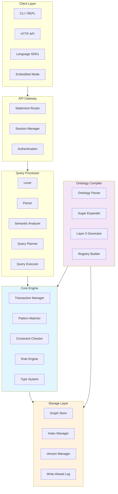

---

## 3. Component Responsibilities

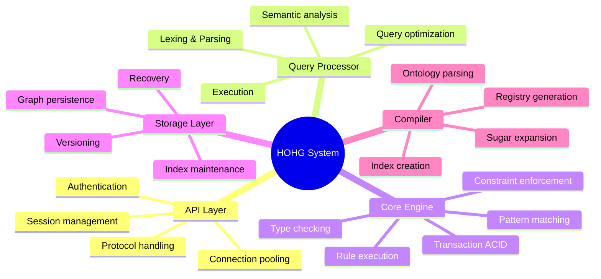

---

## 4. Deployment Modes

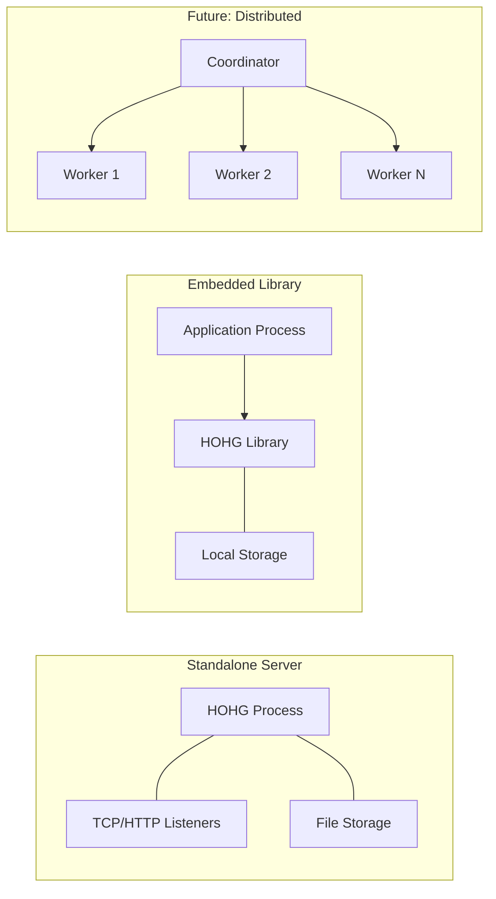

---

# Part II: Data Model

## 5. Hypergraph Structure

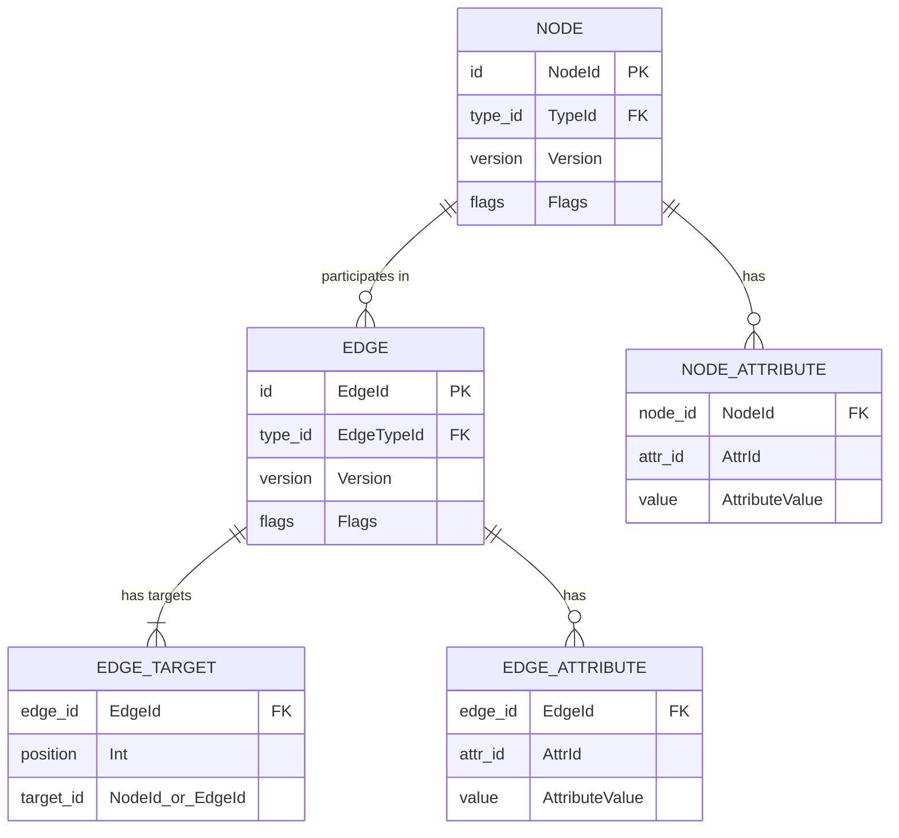

---

## 6. Higher-Order Edge Model

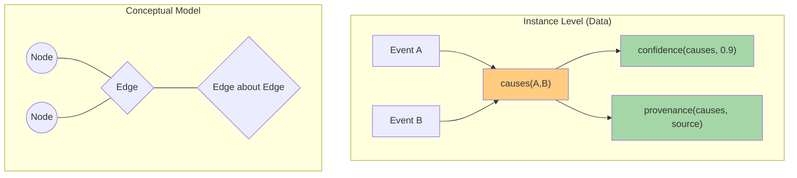

**Key Design Decision:** Nodes and edges share a unified ID space. An edge target can be either a NodeId or an EdgeId, enabling arbitrary nesting depth.

---

## 7. Attribute Value Types

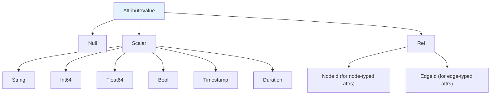

**Design Decision:** No nested structures (maps, lists) in v1. Collections modeled as edges.

---

## 8. Type System Hierarchy

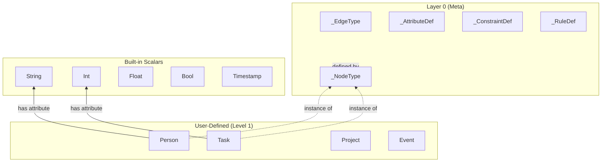

---

# Part III: Storage Architecture

## 9. Storage Layer Components

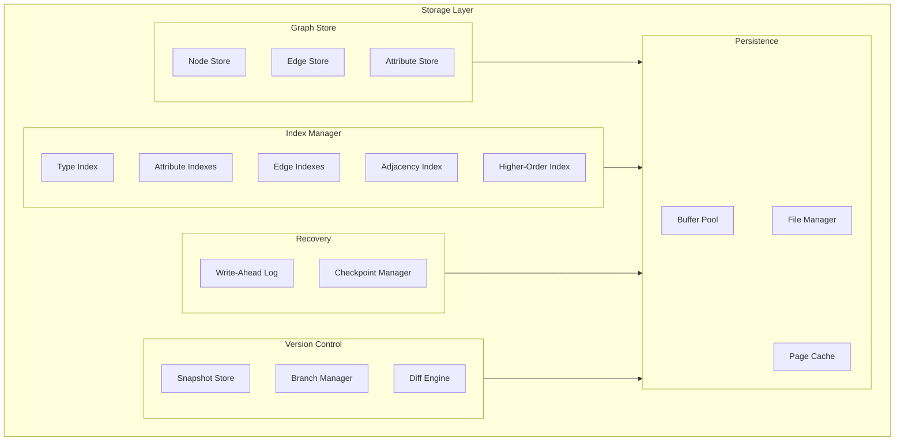

---

## 10. Index Architecture

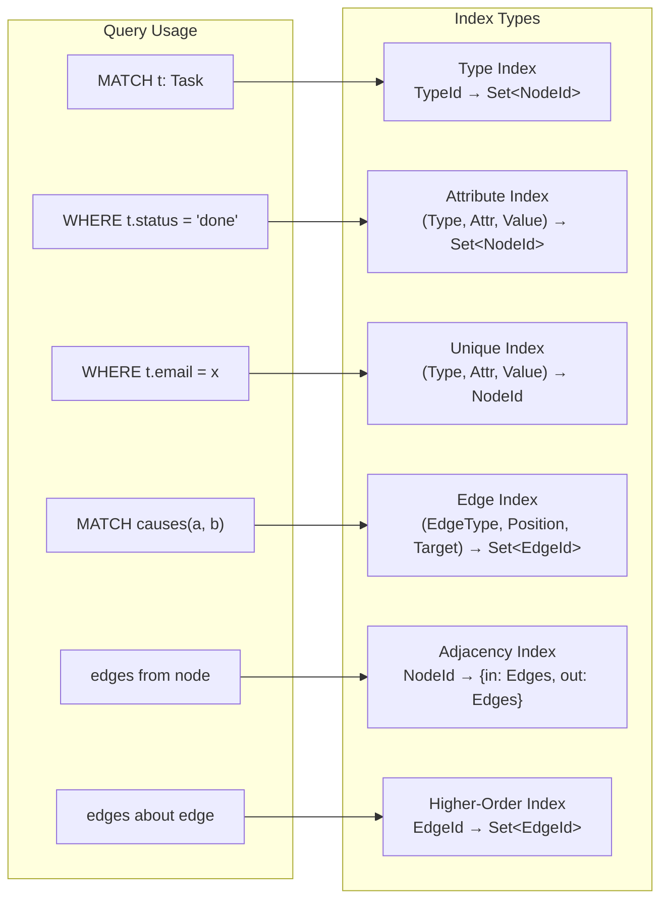

---

## 11. Data Layout Strategy

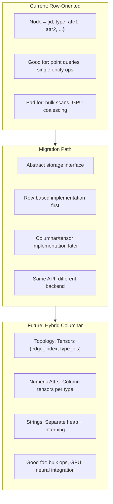

**Design Decision:** Start with row-oriented storage for simplicity. Abstract the interface to allow columnar/tensor migration without API changes.

---

## 12. Write-Ahead Log

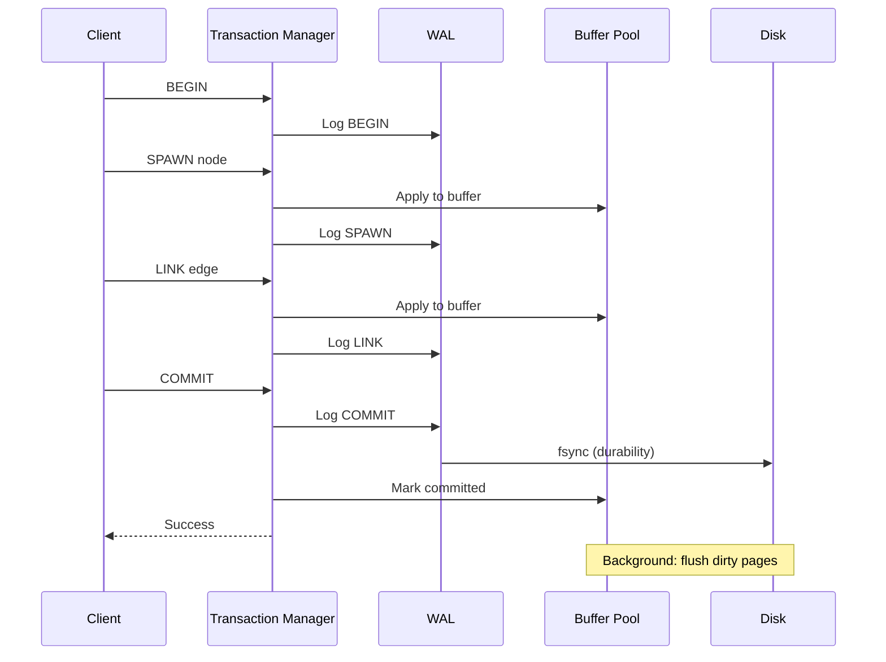

---

## 13. Versioning Model

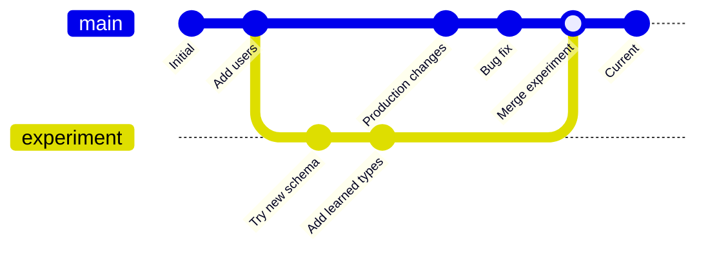

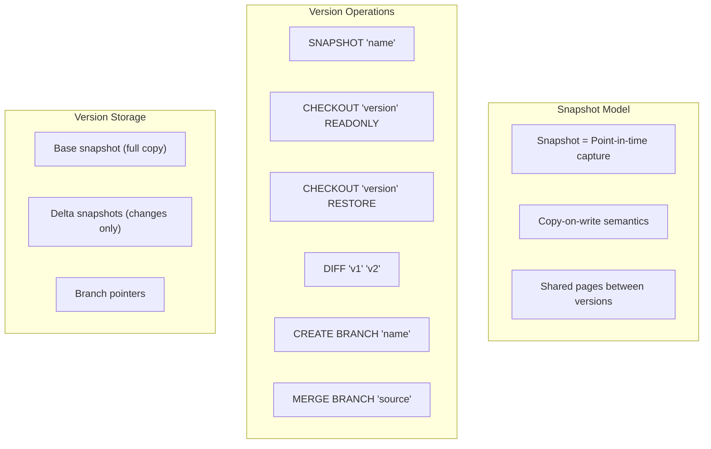

---

# Part IV: Query Processing

## 14. Query Pipeline

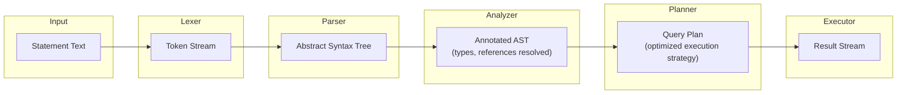

---

## 15. Query Plan Types

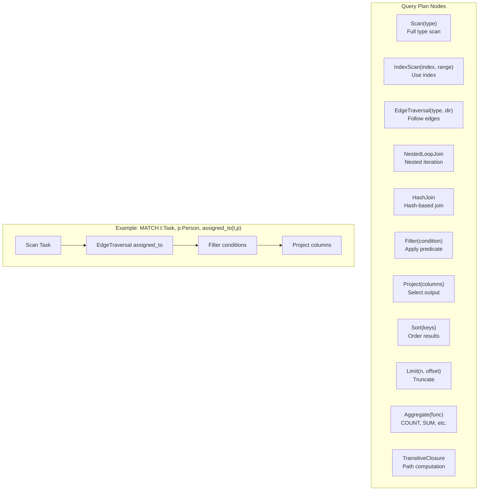

---

## 16. Pattern Matching Strategy

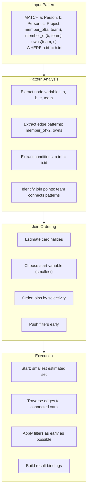

---

## 17. Transitive Closure Algorithm

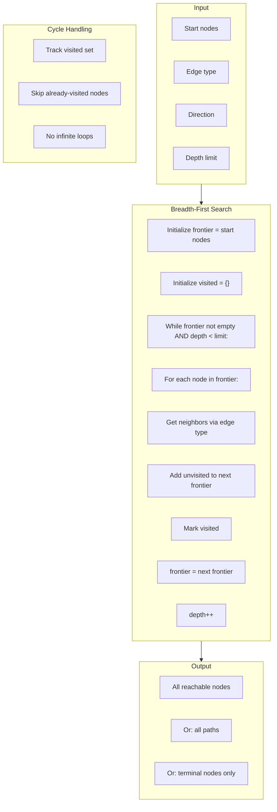

---

# Part V: Constraint & Rule Engine

## 18. Constraint Checking Flow

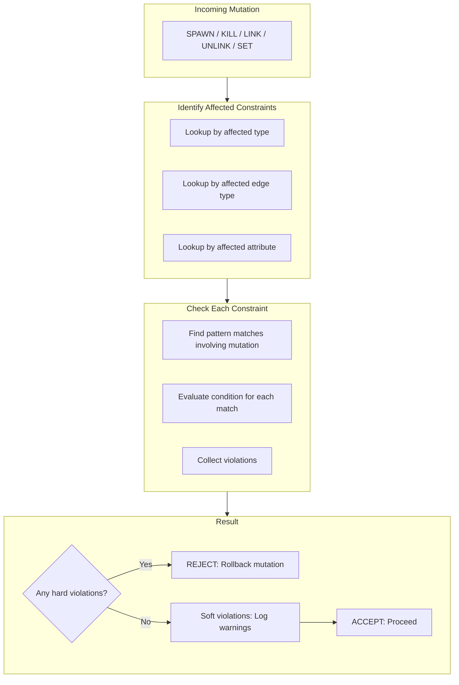

---

## 19. Constraint Categories

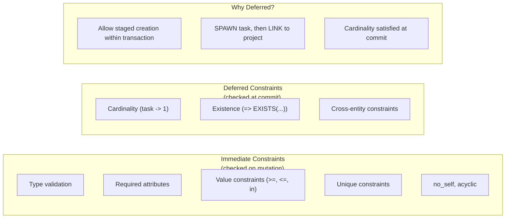

---

## 20. Rule Execution Flow

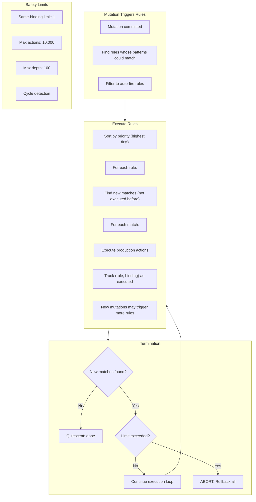

---

## 21. Rule vs Constraint Timing

```mermaid
sequenceDiagram
    participant Client
    participant Engine
    participant Constraints as Constraint Checker
    participant Rules as Rule Engine
    participant Storage

    Client->>Engine: SPAWN Task (no created_at)
    Engine->>Storage: Apply mutation (tentative)
    Engine->>Constraints: Check immediate constraints
    Note over Constraints: Type OK, required OK (has default)
    Constraints-->>Engine: Pass
    
    Engine->>Rules: Find triggered rules
    Note over Rules: auto_timestamp rule matches
    Rules->>Storage: SET created_at = now()
    Rules->>Constraints: Check new mutation
    Constraints-->>Rules: Pass
    Rules-->>Engine: Quiescent
    
    Engine->>Constraints: Check deferred constraints
    Note over Constraints: Cardinality, etc.
    Constraints-->>Engine: Pass
    
    Engine->>Storage: COMMIT
    Storage-->>Engine: Success
    Engine-->>Client: Success
```

**Key Insight:** Rules execute BEFORE deferred constraint checking. Rules can "fix" constraint violations (e.g., auto-populate required fields).

---

# Part VI: Transaction Management

## 22. Transaction States

```mermaid
stateDiagram-v2
    [*] --> Active: BEGIN
    Active --> Active: mutations
    Active --> Committing: COMMIT
    Active --> Aborting: ROLLBACK
    Active --> Aborting: Error
    
    Committing --> Committed: Success
    Committing --> Aborting: Constraint fail
    
    Aborting --> Aborted: Cleanup done
    
    Committed --> [*]
    Aborted --> [*]
```

---

## 23. Transaction Isolation

```mermaid
flowchart TB
    subgraph ReadCommitted["Read Committed (Default)"]
        RC1["Snapshot at statement start"]
        RC2["See committed changes from others"]
        RC3["No dirty reads"]
        RC4["Non-repeatable reads possible"]
    end

    subgraph Serializable["Serializable"]
        S1["Snapshot at transaction start"]
        S2["Track read set"]
        S3["Validate at commit"]
        S4["Conflict → abort"]
        S5["Transactions appear sequential"]
    end

    subgraph Locking["Lock Strategy"]
        L1["Read: shared lock"]
        L2["Write: exclusive lock"]
        L3["Granularity: per-node, per-edge"]
        L4["Deadlock detection: timeout"]
    end
```

---

## 24. Transaction Data Flow

```mermaid
flowchart TB
    subgraph TxState["Transaction State"]
        Created["created_nodes: Map<NodeId, Node>"]
        Deleted["deleted_nodes: Set<NodeId>"]
        Modified["modified_attrs: Map<(Id, Attr), (Old, New)>"]
        Edges["created_edges, deleted_edges"]
        Rules["executed_rules: Set<(RuleId, BindingHash)>"]
    end

    subgraph Read["Read Path"]
        R1["Check created_nodes first"]
        R2["Check deleted_nodes (return null)"]
        R3["Check modified_attrs"]
        R4["Fall through to storage"]
    end

    subgraph Write["Write Path"]
        W1["Validate types"]
        W2["Add to transaction state"]
        W3["Check immediate constraints"]
        W4["Execute rules"]
    end

    subgraph Commit["Commit Path"]
        C1["Acquire locks"]
        C2["Validate read set (if serializable)"]
        C3["Check deferred constraints"]
        C4["Write WAL"]
        C5["Apply to storage"]
        C6["Update indexes"]
        C7["Release locks"]
    end

    TxState --> Read
    TxState --> Write
    Write --> Commit
```

---

# Part VII: Compiler Pipeline

## 25. Ontology Compilation Flow

```mermaid
flowchart TB
    subgraph Input
        Source[".hog Source File"]
    end

    subgraph Parsing["Parsing Phase"]
        P1["Lexer → Tokens"]
        P2["Parser → AST"]
    end

    subgraph Analysis["Analysis Phase"]
        A1["Name Resolution<br/>(resolve type references)"]
        A2["Type Checking<br/>(validate expressions)"]
        A3["Scope Analysis<br/>(variable scoping)"]
    end

    subgraph Expansion["Expansion Phase"]
        E1["Expand type aliases"]
        E2["Expand attribute modifiers → constraints"]
        E3["Expand edge modifiers → constraints/rules"]
    end

    subgraph Validation["Validation Phase"]
        V1["Check ontology coherence"]
        V2["Check inheritance validity"]
        V3["Check constraint patterns"]
    end

    subgraph Generation["Generation Phase"]
        G1["Generate Layer 0 nodes"]
        G2["Generate Layer 0 edges"]
        G3["Build type registry"]
        G4["Build constraint registry"]
        G5["Build rule registry"]
        G6["Create declared indexes"]
    end

    subgraph Output
        O1["Compiled Ontology"]
        O2["Runtime Registries"]
        O3["Index Structures"]
    end

    Source --> Parsing --> Analysis --> Expansion --> Validation --> Generation --> Output
```

---

## 26. Sugar Expansion

```mermaid
flowchart LR
    subgraph Input["DSL Sugar"]
        S1["[required]"]
        S2["[unique]"]
        S3["[>= 0, <= 10]"]
        S4["[no_self]"]
        S5["[acyclic]"]
        S6["[task -> 0..1]"]
        S7["[on_kill: cascade]"]
    end

    subgraph Output["Generated Structures"]
        O1["Constraint: not null check"]
        O2["Constraint + Unique Index"]
        O3["Constraints: min/max checks"]
        O4["Constraint: self-loop prohibition"]
        O5["Constraint: cycle detection"]
        O6["Constraint: cardinality check"]
        O7["Rule: cascade delete"]
    end

    S1 --> O1
    S2 --> O2
    S3 --> O3
    S4 --> O4
    S5 --> O5
    S6 --> O6
    S7 --> O7
```

---

## 27. Registry Structure

```mermaid
flowchart TB
    subgraph TypeRegistry
        TR1["types: Map<Name, TypeDef>"]
        TR2["type_ids: Map<TypeId, TypeDef>"]
        TR3["inheritance_graph: DAG"]
        TR4["subtype_cache: Map<Type, Set<Type>>"]
    end

    subgraph EdgeRegistry
        ER1["edge_types: Map<Name, EdgeTypeDef>"]
        ER2["signatures: EdgeType → List<TypeExpr>"]
    end

    subgraph ConstraintRegistry
        CR1["constraints: List<ConstraintDef>"]
        CR2["by_type: Map<Type, List<Constraint>>"]
        CR3["by_edge_type: Map<EdgeType, List<Constraint>>"]
    end

    subgraph RuleRegistry
        RR1["rules: List<RuleDef>"]
        RR2["auto_rules: List (sorted by priority)"]
        RR3["by_type: Map<Type, List<Rule>>"]
    end

    subgraph Lookup["Fast Lookup"]
        L1["Mutation → affected constraints"]
        L2["Mutation → triggered rules"]
        L3["Type → all subtypes"]
        L4["Type → all attributes (inherited)"]
    end

    TypeRegistry --> Lookup
    EdgeRegistry --> Lookup
    ConstraintRegistry --> Lookup
    RuleRegistry --> Lookup
```

---

# Part VIII: META Mode Architecture

## 28. Level Model

```mermaid
flowchart TB
    subgraph Level0["Level 0: Meta-Meta (Layer 0)"]
        L0_1["_NodeType"]
        L0_2["_EdgeType"]
        L0_3["_ConstraintDef"]
        L0_4["_RuleDef"]
        L0_5["Fixed, hardcoded"]
    end

    subgraph Level1["Level 1: Meta (User Ontology)"]
        L1_1["Person, Task, Project"]
        L1_2["causes, assigned_to"]
        L1_3["temporal_order constraint"]
        L1_4["auto_timestamp rule"]
        L1_5["Instances of Level 0"]
    end

    subgraph Level2["Level 2: Instance (Data)"]
        L2_1["alice: Person"]
        L2_2["task_123: Task"]
        L2_3["causes(event_a, event_b)"]
        L2_4["Instances of Level 1"]
    end

    Level0 -->|defines| Level1
    Level1 -->|defines| Level2
    
    subgraph Access["Access Mode"]
        A1["Normal Mode: Level 2 only"]
        A2["META Mode: Level 1 + Level 2"]
        A3["META ADMIN: Level 0 + Level 1 + Level 2"]
    end
```

---

## 29. META Operations

```mermaid
flowchart LR
    subgraph Read["META READ"]
        R1["META MATCH (schema queries)"]
        R2["META WALK (schema traversal)"]
        R3["META DESCRIBE (type info)"]
        R4["Introspection functions"]
    end

    subgraph Write["META WRITE"]
        W1["META CREATE type/edge"]
        W2["META SET (modify schema)"]
        W3["META ENABLE/DISABLE"]
        W4["Triggers recompilation"]
    end

    subgraph Admin["META ADMIN"]
        A1["META KILL (delete types)"]
        A2["Access to Layer 0"]
        A3["Dangerous operations"]
    end

    Read --> Write --> Admin
```

---

## 30. Schema Recompilation

```mermaid
sequenceDiagram
    participant Client
    participant Engine
    participant Compiler
    participant Registries
    participant Storage

    Client->>Engine: META CREATE NODE NewType {...}
    Engine->>Engine: Acquire schema lock
    Note over Engine: Block new queries
    
    Engine->>Compiler: Compile modification
    Compiler->>Compiler: Parse, validate
    Compiler->>Storage: Update Layer 0 graph
    Compiler->>Registries: Rebuild affected registries
    
    alt Incremental (rule/constraint only)
        Registries->>Registries: Update indexes only
    else Full (type change)
        Registries->>Registries: Rebuild all registries
        Registries->>Storage: Rebuild indexes
    end
    
    Engine->>Engine: Release schema lock
    Engine-->>Client: Success
```

---

# Part IX: API Layer

## 31. Request Flow

```mermaid
sequenceDiagram
    participant Client
    participant Gateway
    participant Session
    participant Parser
    participant Executor
    participant Engine

    Client->>Gateway: Connect
    Gateway->>Session: Create session
    Session-->>Client: Session ID

    Client->>Gateway: Statement
    Gateway->>Session: Get session state
    Gateway->>Parser: Parse statement
    Parser-->>Gateway: AST
    
    alt Query (MATCH, WALK)
        Gateway->>Executor: Execute query
        Executor->>Engine: Pattern match
        Engine-->>Executor: Result stream
        Executor-->>Gateway: Results
    else Mutation (SPAWN, KILL, etc.)
        Gateway->>Engine: Execute mutation
        Engine->>Engine: Transaction logic
        Engine-->>Gateway: Result
    end
    
    Gateway-->>Client: Response
```

---

## 32. Result Streaming

```mermaid
flowchart TB
    subgraph Query["Query Execution"]
        Q1["Query Plan"]
        Q2["Iterator-based execution"]
        Q3["Yield rows one at a time"]
    end

    subgraph Streaming["Result Streaming"]
        S1["Don't buffer entire result"]
        S2["Stream to client"]
        S3["Client can cancel early"]
        S4["Memory-efficient for large results"]
    end

    subgraph Batching["Batch Mode (Alternative)"]
        B1["Collect all results"]
        B2["Apply ORDER BY"]
        B3["Apply LIMIT/OFFSET"]
        B4["Return batch"]
    end

    Query --> Streaming
    Query --> Batching

    subgraph When["When to Use"]
        W1["Streaming: Large results, no ORDER BY"]
        W2["Batching: Small results, needs sorting"]
    end
```

---

# Part X: Future Neural Integration

## 33. Integration Architecture (Deferred)

```mermaid
flowchart TB
    subgraph Current["Current Architecture"]
        C1["Row-oriented storage"]
        C2["CPU-based execution"]
        C3["No tensor primitives"]
    end

    subgraph Bridge["Future: Neural Bridge"]
        B1["Tensor export interface"]
        B2["Zero-copy where possible"]
        B3["Proposal protocol"]
    end

    subgraph Neural["Neural Substrate"]
        N1["External: PyTorch/tinygrad"]
        N2["Graph as tensors"]
        N3["Propose mutations"]
        N4["Evaluate proposals"]
    end

    Current -->|"Abstract interface"| Bridge
    Bridge -->|"Zero-copy"| Neural

    subgraph DesignDecisions["Design Decisions NOW"]
        D1["Abstract storage interface"]
        D2["ID space supports dense packing"]
        D3["Type-separated storage (per-type tensors later)"]
        D4["Batch mutation API"]
    end
```

---

## 34. Design Decisions for Future Tensor Migration

```mermaid
flowchart LR
    subgraph Now["Decisions Now"]
        N1["Unified ID space<br/>(nodes + edges)"]
        N2["Per-type storage separation"]
        N3["Numeric attrs separate from strings"]
        N4["Abstract backend interface"]
        N5["Batch operation support"]
    end

    subgraph Later["Enabled Later"]
        L1["Dense ID ranges per type<br/>→ tensor indexing"]
        L2["Per-type tensors"]
        L3["Columnar numeric storage<br/>→ GPU transfer"]
        L4["Swap row→tensor backend"]
        L5["Bulk neural proposals"]
    end

    N1 --> L1
    N2 --> L2
    N3 --> L3
    N4 --> L4
    N5 --> L5
```

---

# Part XI: Key Design Decisions Summary

## 35. Decision Register

| # | Decision | Rationale | Trade-off |
|---|----------|-----------|-----------|
| D1 | Unified ID space for nodes and edges | Enables higher-order edges naturally | Slightly more complex ID management |
| D2 | Row-oriented storage first | Simpler implementation, familiar | Migration needed for tensor later |
| D3 | Abstract storage interface | Enables backend swapping | Slight abstraction overhead |
| D4 | Per-type storage separation | Enables per-type tensors later | More complex than single store |
| D5 | Numeric/string attribute separation | Enables columnar numeric later | Two storage paths |
| D6 | Constraint checking in mutation path | Guarantees validity | Performance overhead on writes |
| D7 | Rules execute before deferred constraints | Rules can fix violations | More complex execution model |
| D8 | Compile-time ontology optimization | Fast queries | Schema changes need recompile |
| D9 | Layer 0 as hardcoded foundation | Stable meta-model | Can't extend Layer 0 easily |
| D10 | META mode explicit keyword | Clear performance/safety signal | More verbose for reflection |

---

## 36. Component Interaction Matrix

```mermaid
flowchart TB
    subgraph Components
        QP[Query Processor]
        CE[Core Engine]
        ST[Storage]
        CO[Compiler]
        TX[Transaction Mgr]
        CC[Constraint Checker]
        RE[Rule Engine]
        PM[Pattern Matcher]
        IM[Index Manager]
    end

    QP -->|"parse, plan"| CE
    CE -->|"read/write"| ST
    CE -->|"check"| CC
    CE -->|"execute"| RE
    CE -->|"match"| PM
    CO -->|"registries"| CE
    CO -->|"Layer 0"| ST
    TX -->|"ACID"| ST
    PM -->|"use"| IM
    CC -->|"use"| PM
    RE -->|"use"| PM
    RE -->|"mutate"| CE

    style CE fill:#e1f5fe
```

---

## 37. Error Flow

```mermaid
flowchart TB
    subgraph Errors["Error Categories"]
        E1["E1xxx: Syntax"]
        E2["E2xxx: Constraint Violation"]
        E3["E3xxx: Type Error"]
        E4["E4xxx: Not Found"]
        E5["E5xxx: Limit Exceeded"]
        E6["E6xxx: Transaction Error"]
        E7["E7xxx: Storage Error"]
    end

    subgraph Handling["Error Handling"]
        H1["Syntax: Reject at parse"]
        H2["Constraint: Rollback transaction"]
        H3["Type: Reject mutation"]
        H4["Not Found: Return null or error"]
        H5["Limit: Abort with warning"]
        H6["Transaction: Cleanup state"]
        H7["Storage: Attempt recovery"]
    end

    subgraph Recovery["Recovery Actions"]
        R1["User retry"]
        R2["Automatic rollback"]
        R3["WAL replay"]
        R4["Checkpoint restore"]
    end

    Errors --> Handling --> Recovery
```

---

## 38. Performance Characteristics

```mermaid
quadrantChart
    title Operation Performance Profile
    x-axis Low Latency --> High Latency
    y-axis Low Throughput --> High Throughput
    
    quadrant-1 Batch Operations
    quadrant-2 Ideal
    quadrant-3 Point Operations
    quadrant-4 Complex Queries
    
    "Point read": [0.2, 0.3]
    "Index scan": [0.3, 0.7]
    "Pattern match": [0.6, 0.5]
    "Transitive closure": [0.8, 0.4]
    "SPAWN": [0.3, 0.4]
    "Bulk SPAWN": [0.5, 0.8]
    "Rule execution": [0.7, 0.3]
    "META operations": [0.9, 0.2]
```

---

## 39. Scalability Dimensions

```mermaid
flowchart TB
    subgraph Vertical["Vertical Scaling (Current)"]
        V1["More RAM → larger buffer pool"]
        V2["More CPU → parallel queries"]
        V3["Faster SSD → better I/O"]
        V4["GPU → future tensor ops"]
    end

    subgraph Horizontal["Horizontal Scaling (Future)"]
        H1["Partition by type"]
        H2["Partition by ID range"]
        H3["Read replicas"]
        H4["Distributed transactions"]
    end

    subgraph Limits["Current Limits"]
        L1["Single-node only (v1)"]
        L2["All data fits on one machine"]
        L3["Scale up, not out"]
    end

    subgraph FutureProof["Future-Proofing"]
        F1["Stateless query processors"]
        F2["Shareable storage interface"]
        F3["Partition-aware ID generation"]
    end
```

---

# Appendix A: Data Flow Diagrams

## A.1 MATCH Execution

```mermaid
flowchart TB
    subgraph Input
        I["MATCH t:Task, p:Person, assigned_to(t,p)<br/>WHERE t.status = 'done'<br/>RETURN t.title, p.name"]
    end

    subgraph Parse
        P1["Pattern: 2 node vars, 1 edge pattern"]
        P2["Where: t.status = 'done'"]
        P3["Return: t.title, p.name"]
    end

    subgraph Plan
        PL1["Start: Task (smaller)"]
        PL2["Filter: status = 'done' (use index)"]
        PL3["Traverse: assigned_to edges"]
        PL4["Fetch: Person nodes"]
        PL5["Project: title, name"]
    end

    subgraph Execute
        E1["IndexScan(Task, status='done')"]
        E2["For each task: EdgeLookup(assigned_to, task)"]
        E3["For each edge: FetchNode(person)"]
        E4["Yield (task.title, person.name)"]
    end

    Input --> Parse --> Plan --> Execute
```

## A.2 SPAWN Execution

```mermaid
flowchart TB
    subgraph Input
        I["SPAWN t: Task { title = 'Test', priority = 5 }"]
    end

    subgraph Validate
        V1["Lookup Task type"]
        V2["Check not abstract"]
        V3["Check required attrs (title: ✓)"]
        V4["Apply defaults (status = 'todo')"]
        V5["Type check values"]
    end

    subgraph Apply
        A1["Allocate NodeId"]
        A2["Create Node in txn buffer"]
        A3["Log to WAL"]
    end

    subgraph Constraints
        C1["Check immediate constraints"]
        C2["Attribute validations: ✓"]
    end

    subgraph Rules
        R1["Find triggered rules"]
        R2["auto_timestamp matches"]
        R3["Execute: SET created_at = now()"]
        R4["Quiescent"]
    end

    subgraph Commit
        CM1["Check deferred constraints"]
        CM2["Cardinality: (no belongs_to yet, OK if not required)"]
        CM3["Commit to storage"]
        CM4["Update indexes"]
    end

    Input --> Validate --> Apply --> Constraints --> Rules --> Commit
```

---

# Appendix B: State Machines

## B.1 Session State

```mermaid
stateDiagram-v2
    [*] --> Connected: Connect
    Connected --> InTransaction: BEGIN
    Connected --> Connected: Query/Mutation (auto-commit)
    InTransaction --> InTransaction: Query/Mutation
    InTransaction --> Connected: COMMIT/ROLLBACK
    Connected --> ReadOnly: CHECKOUT READONLY
    ReadOnly --> Connected: CHECKOUT HEAD
    ReadOnly --> ReadOnly: Query only
    Connected --> [*]: Disconnect
    InTransaction --> [*]: Disconnect (auto-rollback)
```

## B.2 Query Execution State

```mermaid
stateDiagram-v2
    [*] --> Parsing: Statement received
    Parsing --> Analyzing: Parse success
    Parsing --> Error: Parse failure
    Analyzing --> Planning: Analysis success
    Analyzing --> Error: Analysis failure
    Planning --> Executing: Plan ready
    Executing --> Streaming: First result
    Streaming --> Streaming: More results
    Streaming --> Complete: No more results
    Executing --> Complete: Empty result
    Executing --> Error: Execution failure
    Streaming --> Cancelled: Client cancel
    Complete --> [*]
    Error --> [*]
    Cancelled --> [*]
```

---

# Appendix C: Index Selection Decision Tree

```mermaid
flowchart TB
    Start["Query Pattern"]
    
    Start --> Q1{"Has equality<br/>condition?"}
    Q1 -->|Yes| Q2{"Unique attr?"}
    Q2 -->|Yes| A1["Use Unique Index<br/>O(1)"]
    Q2 -->|No| Q3{"Has index?"}
    Q3 -->|Yes| A2["Use Attribute Index<br/>O(log n + k)"]
    Q3 -->|No| A3["Type Scan + Filter<br/>O(n)"]
    
    Q1 -->|No| Q4{"Has range<br/>condition?"}
    Q4 -->|Yes| Q5{"Indexed attr?"}
    Q5 -->|Yes| A4["Use Range Scan<br/>O(log n + k)"]
    Q5 -->|No| A3
    
    Q4 -->|No| Q6{"Type only?"}
    Q6 -->|Yes| A5["Use Type Index<br/>O(k)"]
    Q6 -->|No| A6["Full Scan<br/>O(N)"]
```

---

*End of HOHG System Architecture v2.0*