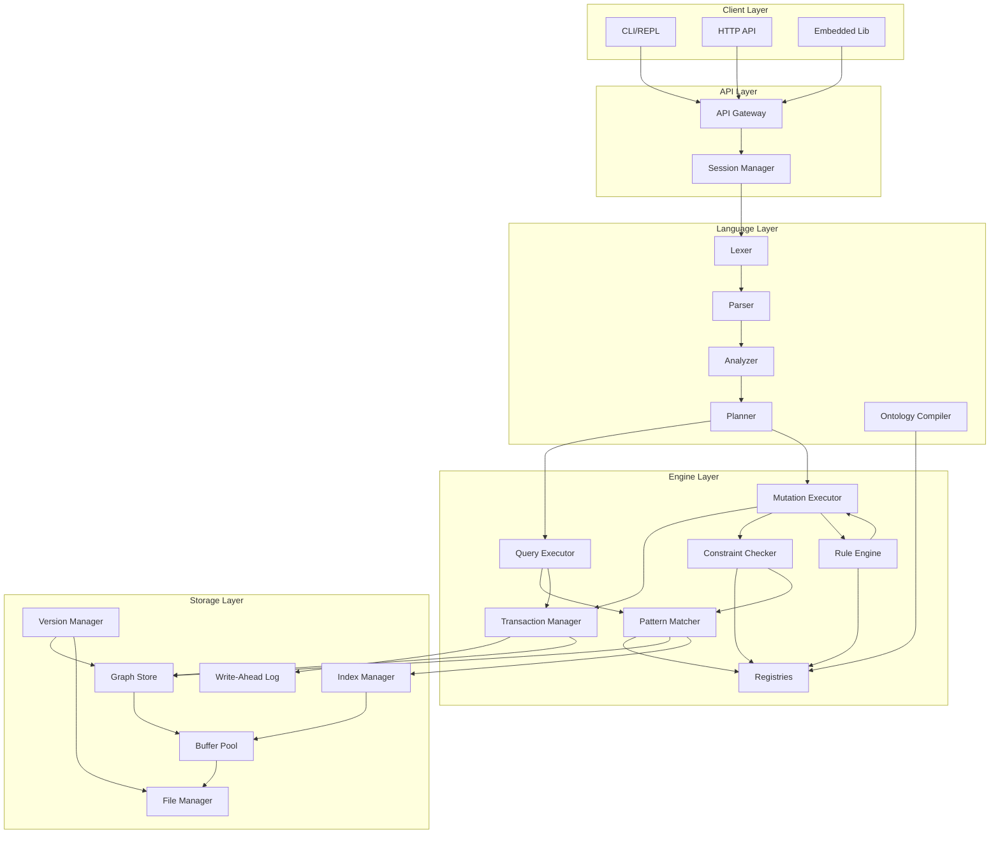

# HOHG System Architecture

**Version:** 2.0
**Status:** Design Specification
**Purpose:** Component map, interactions, data flows, and core abstractions

---

# Part I: System Overview

## 1. Architecture Principles

```
┌─────────────────────────────────────────────────────────────────────────────┐
│                         DESIGN PRINCIPLES                                    │
├─────────────────────────────────────────────────────────────────────────────┤
│                                                                              │
│  1. SEPARATION OF CONCERNS                                                  │
│     ┌──────────┐   ┌──────────┐   ┌──────────┐   ┌──────────┐             │
│     │ Language │   │  Engine  │   │ Storage  │   │   API    │             │
│     │ (Parse)  │   │ (Logic)  │   │ (Persist)│   │ (Expose) │             │
│     └──────────┘   └──────────┘   └──────────┘   └──────────┘             │
│                                                                              │
│  2. LAYERED ABSTRACTION                                                     │
│     API → Engine → Storage (each layer only talks to adjacent)             │
│                                                                              │
│  3. SINGLE SOURCE OF TRUTH                                                  │
│     Ontology compiles to registries; registries drive all validation       │
│                                                                              │
│  4. FAIL-FAST VALIDATION                                                    │
│     Type errors at parse time, constraint errors at mutation time          │
│                                                                              │
│  5. EXTENSIBILITY POINTS                                                    │
│     Storage backend swappable, tensor integration planned                  │
│                                                                              │
└─────────────────────────────────────────────────────────────────────────────┘
```

---

## 2. High-Level Component Map

```
┌─────────────────────────────────────────────────────────────────────────────┐
│                              HOHG SYSTEM                                     │
├─────────────────────────────────────────────────────────────────────────────┤
│                                                                              │
│  ┌─────────────────────────────────────────────────────────────────────┐   │
│  │                         CLIENT INTERFACES                            │   │
│  │  ┌─────────┐  ┌─────────┐  ┌─────────┐  ┌─────────────────────────┐ │   │
│  │  │  REPL   │  │  HTTP   │  │  gRPC   │  │  Embedded (Library)     │ │   │
│  │  │  (CLI)  │  │  (REST) │  │         │  │                         │ │   │
│  │  └────┬────┘  └────┬────┘  └────┬────┘  └────────────┬────────────┘ │   │
│  └───────┼────────────┼────────────┼────────────────────┼──────────────┘   │
│          └────────────┴────────────┴────────────────────┘                   │
│                                    │                                         │
│                                    ▼                                         │
│  ┌─────────────────────────────────────────────────────────────────────┐   │
│  │                         API GATEWAY                                  │   │
│  │                                                                      │   │
│  │  • Session Management    • Connection Pooling    • Auth (stub)      │   │
│  │  • Statement Routing     • Result Encoding       • Rate Limiting    │   │
│  └──────────────────────────────────┬──────────────────────────────────┘   │
│                                     │                                        │
│                                     ▼                                        │
│  ┌─────────────────────────────────────────────────────────────────────┐   │
│  │                      LANGUAGE PROCESSOR                              │   │
│  │  ┌───────────────────────────────────────────────────────────────┐  │   │
│  │  │                    Statement Pipeline                          │  │   │
│  │  │   ┌───────┐   ┌────────┐   ┌──────────┐   ┌─────────────┐    │  │   │
│  │  │   │ Lexer │──▶│ Parser │──▶│ Analyzer │──▶│   Planner   │    │  │   │
│  │  │   └───────┘   └────────┘   └──────────┘   └─────────────┘    │  │   │
│  │  └───────────────────────────────────────────────────────────────┘  │   │
│  │  ┌───────────────────────────────────────────────────────────────┐  │   │
│  │  │                   Ontology Compiler                            │  │   │
│  │  │   ┌────────┐   ┌──────────┐   ┌───────────┐   ┌───────────┐  │  │   │
│  │  │   │ Parser │──▶│ Expander │──▶│ Validator │──▶│ Generator │  │  │   │
│  │  │   └────────┘   └──────────┘   └───────────┘   └───────────┘  │  │   │
│  │  └───────────────────────────────────────────────────────────────┘  │   │
│  └──────────────────────────────────┬──────────────────────────────────┘   │
│                                     │                                        │
│                                     ▼                                        │
│  ┌─────────────────────────────────────────────────────────────────────┐   │
│  │                         CORE ENGINE                                  │   │
│  │                                                                      │   │
│  │  ┌──────────────┐  ┌──────────────┐  ┌──────────────────────────┐  │   │
│  │  │  Transaction │  │   Pattern    │  │    Query Executor        │  │   │
│  │  │   Manager    │  │   Matcher    │  │                          │  │   │
│  │  └──────────────┘  └──────────────┘  └──────────────────────────┘  │   │
│  │                                                                      │   │
│  │  ┌──────────────┐  ┌──────────────┐  ┌──────────────────────────┐  │   │
│  │  │  Constraint  │  │    Rule      │  │    Mutation Executor     │  │   │
│  │  │   Checker    │  │   Engine     │  │                          │  │   │
│  │  └──────────────┘  └──────────────┘  └──────────────────────────┘  │   │
│  │                                                                      │   │
│  │  ┌────────────────────────────────────────────────────────────────┐│   │
│  │  │                    Runtime Registries                          ││   │
│  │  │  ┌─────────┐ ┌─────────┐ ┌────────────┐ ┌─────────┐           ││   │
│  │  │  │  Types  │ │  Edges  │ │ Constraints│ │  Rules  │           ││   │
│  │  │  └─────────┘ └─────────┘ └────────────┘ └─────────┘           ││   │
│  │  └────────────────────────────────────────────────────────────────┘│   │
│  └──────────────────────────────────┬──────────────────────────────────┘   │
│                                     │                                        │
│                                     ▼                                        │
│  ┌─────────────────────────────────────────────────────────────────────┐   │
│  │                         STORAGE LAYER                                │   │
│  │                                                                      │   │
│  │  ┌──────────────┐  ┌──────────────┐  ┌──────────────────────────┐  │   │
│  │  │    Graph     │  │    Index     │  │      Version             │  │   │
│  │  │    Store     │  │   Manager    │  │      Manager             │  │   │
│  │  └──────────────┘  └──────────────┘  └──────────────────────────┘  │   │
│  │                                                                      │   │
│  │  ┌──────────────┐  ┌──────────────┐  ┌──────────────────────────┐  │   │
│  │  │     WAL      │  │   Buffer     │  │      File Manager        │  │   │
│  │  │              │  │    Pool      │  │                          │  │   │
│  │  └──────────────┘  └──────────────┘  └──────────────────────────┘  │   │
│  └─────────────────────────────────────────────────────────────────────┘   │
│                                                                              │
└─────────────────────────────────────────────────────────────────────────────┘
```

---

## 3. Component Dependency Graph



---

## 4. Data Flow Overview

### 4.1 Query Execution Flow

```
┌─────────────────────────────────────────────────────────────────────────────┐
│                         QUERY EXECUTION FLOW                                 │
└─────────────────────────────────────────────────────────────────────────────┘

  "MATCH t: Task WHERE t.priority > 5 RETURN t"
                          │
                          ▼
┌─────────────────────────────────────────────────────────────────────────────┐
│ LEXER                                                                        │
│ Tokenize input string into token stream                                     │
├─────────────────────────────────────────────────────────────────────────────┤
│ Output: [MATCH, IDENT:t, COLON, IDENT:Task, WHERE, IDENT:t, DOT,           │
│          IDENT:priority, GT, INT:5, RETURN, IDENT:t]                        │
└─────────────────────────────────────────────────────────────────────────────┘
                          │
                          ▼
┌─────────────────────────────────────────────────────────────────────────────┐
│ PARSER                                                                       │
│ Build Abstract Syntax Tree from tokens                                      │
├─────────────────────────────────────────────────────────────────────────────┤
│ Output: MatchStmt {                                                         │
│           pattern: Pattern { vars: [t:Task], edges: [] },                   │
│           where: BinaryOp(GT, AttrAccess(t, priority), Literal(5)),        │
│           return: [VarRef(t)]                                               │
│         }                                                                   │
└─────────────────────────────────────────────────────────────────────────────┘
                          │
                          ▼
┌─────────────────────────────────────────────────────────────────────────────┐
│ ANALYZER                                                                     │
│ Resolve names, check types, annotate AST                                    │
├─────────────────────────────────────────────────────────────────────────────┤
│ • Lookup "Task" in TypeRegistry → TypeId(7)                                │
│ • Lookup "priority" on Task → AttrId(3), type=Int                          │
│ • Verify: Int > Int → Bool ✓                                               │
│ Output: Annotated AST with type info                                        │
└─────────────────────────────────────────────────────────────────────────────┘
                          │
                          ▼
┌─────────────────────────────────────────────────────────────────────────────┐
│ PLANNER                                                                      │
│ Generate optimized execution plan                                           │
├─────────────────────────────────────────────────────────────────────────────┤
│ • Check index on Task.priority → IndexId(12), desc                         │
│ • Choose: IndexScan(Task.priority > 5) vs TypeScan(Task) + Filter          │
│ • Estimate costs, pick best plan                                           │
│                                                                              │
│ Output: QueryPlan {                                                         │
│           IndexScan(idx=12, range=(5, ∞)) → Project([t])                   │
│         }                                                                   │
└─────────────────────────────────────────────────────────────────────────────┘
                          │
                          ▼
┌─────────────────────────────────────────────────────────────────────────────┐
│ EXECUTOR                                                                     │
│ Execute plan, stream results                                                │
├─────────────────────────────────────────────────────────────────────────────┤
│ • Open index cursor at priority > 5                                        │
│ • For each matching node ID:                                               │
│   • Fetch node from GraphStore                                             │
│   • Yield to result stream                                                 │
│                                                                              │
│ Output: Iterator<Row> streaming to client                                   │
└─────────────────────────────────────────────────────────────────────────────┘
```

### 4.2 Mutation Execution Flow

```
┌─────────────────────────────────────────────────────────────────────────────┐
│                        MUTATION EXECUTION FLOW                               │
└─────────────────────────────────────────────────────────────────────────────┘

  "SPAWN t: Task { title = 'New', priority = 8 }"
                          │
                          ▼
┌──────────────────────────────────────────────────┐
│ PARSE + ANALYZE (same as query)                  │
└──────────────────────────────────────────────────┘
                          │
                          ▼
┌─────────────────────────────────────────────────────────────────────────────┐
│ TRANSACTION MANAGER                                                          │
│ Begin or join transaction                                                   │
├─────────────────────────────────────────────────────────────────────────────┤
│ • If auto-commit: create new transaction                                    │
│ • If explicit BEGIN: use existing transaction                               │
│ • Assign LSN, acquire locks as needed                                       │
└─────────────────────────────────────────────────────────────────────────────┘
                          │
                          ▼
┌─────────────────────────────────────────────────────────────────────────────┐
│ TYPE VALIDATION                                                              │
├─────────────────────────────────────────────────────────────────────────────┤
│ • Task.abstract = false? ✓                                                  │
│ • title: String, "New" is String ✓                                         │
│ • priority: Int, 8 is Int ✓                                                │
│ • Required attrs present? (check Task.title required) ✓                    │
│ • Apply defaults for missing optional attrs                                 │
└─────────────────────────────────────────────────────────────────────────────┘
                          │
                          ▼
┌─────────────────────────────────────────────────────────────────────────────┐
│ GRAPH STORE                                                                  │
│ Apply mutation (tentatively in transaction buffer)                          │
├─────────────────────────────────────────────────────────────────────────────┤
│ • Allocate new NodeId                                                       │
│ • Create Node { id, type=Task, attrs={title, priority, status="todo"} }   │
│ • Add to transaction write set                                              │
└─────────────────────────────────────────────────────────────────────────────┘
                          │
                          ▼
┌─────────────────────────────────────────────────────────────────────────────┐
│ RULE ENGINE                                                                  │
│ Find and execute triggered rules (BEFORE constraint checking)              │
├─────────────────────────────────────────────────────────────────────────────┤
│ • Get auto-rules affecting type=Task, sorted by priority                   │
│ • For each rule:                                                            │
│   • Match pattern against current graph (including txn buffer)             │
│   • For each new match (not in executed set):                              │
│     • Execute production actions (may spawn more mutations)                │
│     • Add spawned mutations to queue                                       │
│ • Repeat until quiescence or limit reached                                 │
│                                                                              │
│ NOTE: Rules execute BEFORE constraints so they can "fix" violations.       │
│       Example: auto_timestamp rule sets created_at before required check.  │
└─────────────────────────────────────────────────────────────────────────────┘
                          │
                          ▼
┌─────────────────────────────────────────────────────────────────────────────┐
│ CONSTRAINT CHECKER                                                           │
│ Check all constraints after rule quiescence                                 │
├─────────────────────────────────────────────────────────────────────────────┤
│ • Get constraints affecting modified types                                  │
│ • For each constraint:                                                      │
│   • Match pattern against current graph (including txn buffer)             │
│   • Evaluate condition                                                      │
│   • If hard constraint fails → ABORT entire transaction                    │
│   • If soft constraint fails → WARN                                        │
└─────────────────────────────────────────────────────────────────────────────┘
                          │
                          ▼
┌─────────────────────────────────────────────────────────────────────────────┐
│ DEFERRED CONSTRAINT CHECK                                                    │
│ Check cardinality constraints at commit                                     │
├─────────────────────────────────────────────────────────────────────────────┤
│ • Minimum cardinality constraints (e.g., task -> 1 on belongs_to)          │
│ • Existence constraints (=> EXISTS(...))                                    │
│ • If any fail → ABORT entire transaction                                   │
└─────────────────────────────────────────────────────────────────────────────┘
                          │
                          ▼
┌─────────────────────────────────────────────────────────────────────────────┐
│ COMMIT                                                                       │
├─────────────────────────────────────────────────────────────────────────────┤
│ • Write WAL records                                                         │
│ • Flush WAL to disk (fsync)                                                │
│ • Apply changes to Graph Store (in-memory)                                 │
│ • Update indexes                                                            │
│ • Release locks                                                             │
│ • Return result to client                                                   │
└─────────────────────────────────────────────────────────────────────────────┘
```

### 4.3 Ontology Loading Flow

```
┌─────────────────────────────────────────────────────────────────────────────┐
│                       ONTOLOGY LOADING FLOW                                  │
└─────────────────────────────────────────────────────────────────────────────┘

  ontology TaskManagement { node Task { ... } edge belongs_to(...) [...] }
                          │
                          ▼
┌─────────────────────────────────────────────────────────────────────────────┐
│ ONTOLOGY PARSER                                                              │
│ Parse DSL into Ontology AST                                                 │
├─────────────────────────────────────────────────────────────────────────────┤
│ Output: OntologyAST {                                                       │
│           name: "TaskManagement",                                           │
│           nodeTypes: [Task, Person, Project, ...],                         │
│           edgeTypes: [belongs_to, assigned_to, ...],                       │
│           constraints: [...],                                               │
│           rules: [...]                                                      │
│         }                                                                   │
└─────────────────────────────────────────────────────────────────────────────┘
                          │
                          ▼
┌─────────────────────────────────────────────────────────────────────────────┐
│ SUGAR EXPANDER                                                               │
│ Expand modifiers into explicit constraints/rules                            │
├─────────────────────────────────────────────────────────────────────────────┤
│ • [required] on attr → generate required constraint                        │
│ • [unique] on attr → generate uniqueness constraint + index hint           │
│ • [>= N] on attr → generate range constraint                               │
│ • [no_self] on edge → generate self-loop constraint                        │
│ • [acyclic] on edge → generate cycle constraint                            │
│ • [on_kill: cascade] → generate cascade rule                               │
│                                                                              │
│ Output: Expanded AST with explicit constraints/rules                        │
└─────────────────────────────────────────────────────────────────────────────┘
                          │
                          ▼
┌─────────────────────────────────────────────────────────────────────────────┐
│ VALIDATOR                                                                    │
│ Check ontology consistency                                                  │
├─────────────────────────────────────────────────────────────────────────────┤
│ • No duplicate type names                                                   │
│ • No inheritance cycles                                                     │
│ • All referenced types exist                                               │
│ • Attribute types valid                                                     │
│ • Edge signatures valid                                                     │
│ • Constraint patterns well-formed                                          │
│ • Rule patterns and productions well-formed                                │
└─────────────────────────────────────────────────────────────────────────────┘
                          │
                          ▼
┌─────────────────────────────────────────────────────────────────────────────┐
│ LAYER 0 GENERATOR                                                            │
│ Generate Layer 0 graph structure                                            │
├─────────────────────────────────────────────────────────────────────────────┤
│ For each node type:                                                         │
│   • Create _NodeType node                                                   │
│   • Create _AttributeDef nodes                                              │
│   • Create _type_has_attribute edges                                        │
│   • Create _type_inherits edges                                             │
│                                                                              │
│ For each edge type:                                                         │
│   • Create _EdgeType node                                                   │
│   • Create _VarDef nodes for signature                                      │
│   • Create _edge_has_position edges                                         │
│                                                                              │
│ For each constraint: (similar pattern structure)                            │
│ For each rule: (similar pattern structure)                                  │
└─────────────────────────────────────────────────────────────────────────────┘
                          │
                          ▼
┌─────────────────────────────────────────────────────────────────────────────┐
│ REGISTRY BUILDER                                                             │
│ Build runtime registries from ontology                                      │
├─────────────────────────────────────────────────────────────────────────────┤
│ TypeRegistry:                                                               │
│   • Map<TypeName, TypeDef>                                                 │
│   • Inheritance graph                                                       │
│   • Precomputed subtypes                                                   │
│                                                                              │
│ EdgeTypeRegistry:                                                           │
│   • Map<EdgeName, EdgeTypeDef>                                             │
│   • Signature lookup                                                        │
│                                                                              │
│ ConstraintRegistry:                                                         │
│   • List<CompiledConstraint>                                               │
│   • Index: TypeId → affecting constraints                                  │
│                                                                              │
│ RuleRegistry:                                                               │
│   • List<CompiledRule> sorted by priority                                  │
│   • Index: TypeId → triggered rules                                        │
└─────────────────────────────────────────────────────────────────────────────┘
                          │
                          ▼
┌─────────────────────────────────────────────────────────────────────────────┐
│ INDEX BUILDER                                                                │
│ Create indexes declared in ontology                                         │
├─────────────────────────────────────────────────────────────────────────────┤
│ • For each [indexed] attribute: create attribute index                     │
│ • For each [unique] attribute: create unique index                         │
│ • Type index always created                                                 │
│ • Edge index for each edge type                                            │
└─────────────────────────────────────────────────────────────────────────────┘
                          │
                          ▼
               Ontology Active, Ready for Queries
```

---

# Part II: Core Data Model

## 5. Entity Representation

```
┌─────────────────────────────────────────────────────────────────────────────┐
│                            NODE STRUCTURE                                    │
├─────────────────────────────────────────────────────────────────────────────┤
│                                                                              │
│  ┌─────────────────────────────────────────────────────────────────────┐   │
│  │ Node                                                                 │   │
│  ├─────────────────────────────────────────────────────────────────────┤   │
│  │ id: NodeId (64-bit)          ← Globally unique, immutable           │   │
│  │ type_id: TypeId (32-bit)     ← Reference to TypeRegistry            │   │
│  │ version: u64                 ← MVCC version number                  │   │
│  │ flags: u8                    ← deleted, pending, has_ho_edges       │   │
│  │ attributes: AttributeStore  ← Attribute values                      │   │
│  └─────────────────────────────────────────────────────────────────────┘   │
│                                                                              │
│  AttributeStore Layout (per node):                                          │
│  ┌─────────────────────────────────────────────────────────────────────┐   │
│  │ For fixed-schema types (known attribute count):                     │   │
│  │   [Value0, Value1, Value2, ...]  ← Dense array, index = attr_id    │   │
│  │                                                                      │   │
│  │ For dynamic/inherited types:                                        │   │
│  │   HashMap<AttrId, Value>         ← Sparse, flexible                 │   │
│  └─────────────────────────────────────────────────────────────────────┘   │
│                                                                              │
└─────────────────────────────────────────────────────────────────────────────┘

┌─────────────────────────────────────────────────────────────────────────────┐
│                            EDGE STRUCTURE                                    │
├─────────────────────────────────────────────────────────────────────────────┤
│                                                                              │
│  ┌─────────────────────────────────────────────────────────────────────┐   │
│  │ Edge                                                                 │   │
│  ├─────────────────────────────────────────────────────────────────────┤   │
│  │ id: EdgeId (64-bit)          ← Globally unique, immutable           │   │
│  │ type_id: EdgeTypeId (32-bit) ← Reference to EdgeTypeRegistry        │   │
│  │ targets: TargetList          ← Ordered list of NodeId | EdgeId      │   │
│  │ version: u64                 ← MVCC version number                  │   │
│  │ flags: u8                    ← deleted, pending, is_higher_order    │   │
│  │ attributes: AttributeStore  ← Edge attribute values                 │   │
│  └─────────────────────────────────────────────────────────────────────┘   │
│                                                                              │
│  TargetList variants:                                                       │
│  ┌─────────────────────────────────────────────────────────────────────┐   │
│  │ Binary edge (arity=2):   [NodeId, NodeId]        ← 16 bytes         │   │
│  │ Ternary edge (arity=3):  [NodeId, NodeId, NodeId] ← 24 bytes        │   │
│  │ Higher-order:            [EdgeId, ...]           ← EdgeId in targets│   │
│  │ Hyperedge (arity=N):     [NodeId × N]            ← Variable size    │   │
│  └─────────────────────────────────────────────────────────────────────┘   │
│                                                                              │
│  ID Space:                                                                  │
│  ┌─────────────────────────────────────────────────────────────────────┐   │
│  │ NodeId and EdgeId: both 64-bit, allocated from shared sequence      │   │
│  │                                                                      │   │
│  │ Distinction mechanism:                                               │   │
│  │   • Contextual: edge type signature specifies expected type at      │   │
│  │     each position (e.g., edge<causes> at position 0 → expect EdgeId)│   │
│  │   • For higher-order edges: is_higher_order flag set on edge        │   │
│  │   • For generic META queries: check entity existence in both stores │   │
│  │                                                                      │   │
│  │ Rationale: Shared ID space simplifies allocation and allows         │   │
│  │ uniform ID handling. Type safety comes from schema, not ID format.  │   │
│  └─────────────────────────────────────────────────────────────────────┘   │
│                                                                              │
└─────────────────────────────────────────────────────────────────────────────┘
```

## 6. Higher-Order Edge Model

```
┌─────────────────────────────────────────────────────────────────────────────┐
│                        HIGHER-ORDER EDGES                                    │
├─────────────────────────────────────────────────────────────────────────────┤
│                                                                              │
│  Example: causes(e1, e2) with confidence                                    │
│                                                                              │
│  ┌─────────┐         causes         ┌─────────┐                            │
│  │ Event   │ ───────(edge_1)───────▶│ Event   │                            │
│  │ (e1)    │                        │ (e2)    │                            │
│  └─────────┘                        └─────────┘                            │
│                  │                                                          │
│                  │ confidence (edge_2)                                      │
│                  ▼                                                          │
│            ┌──────────┐                                                     │
│            │ level:   │                                                     │
│            │ 0.85     │                                                     │
│            └──────────┘                                                     │
│                                                                              │
│  In storage:                                                                │
│  ┌─────────────────────────────────────────────────────────────────────┐   │
│  │ edge_1 (causes):                                                     │   │
│  │   id: "edge_1"                                                       │   │
│  │   type_id: EdgeType(causes)                                         │   │
│  │   targets: [NodeId(e1), NodeId(e2)]                                 │   │
│  │   flags: has_higher_order = true                                    │   │
│  ├─────────────────────────────────────────────────────────────────────┤   │
│  │ edge_2 (confidence):                                                 │   │
│  │   id: "edge_2"                                                       │   │
│  │   type_id: EdgeType(confidence)                                     │   │
│  │   targets: [EdgeId(edge_1)]  ← Points to edge, not node             │   │
│  │   attributes: { level: 0.85 }                                       │   │
│  │   flags: is_higher_order = true                                     │   │
│  └─────────────────────────────────────────────────────────────────────┘   │
│                                                                              │
│  Higher-Order Index:                                                        │
│  ┌─────────────────────────────────────────────────────────────────────┐   │
│  │ EdgeId → Set<EdgeId>  (edges that target this edge)                 │   │
│  │                                                                      │   │
│  │ edge_1 → {edge_2}                                                   │   │
│  │                                                                      │   │
│  │ Used for:                                                           │   │
│  │   • Cascade deletion (unlink edge_1 → auto unlink edge_2)          │   │
│  │   • Meta queries (find all edges about edge X)                      │   │
│  └─────────────────────────────────────────────────────────────────────┘   │
│                                                                              │
└─────────────────────────────────────────────────────────────────────────────┘
```

## 7. Attribute Value Types

```
┌─────────────────────────────────────────────────────────────────────────────┐
│                          VALUE REPRESENTATION                                │
├─────────────────────────────────────────────────────────────────────────────┤
│                                                                              │
│  Value (tagged union, 16-24 bytes):                                         │
│  ┌─────────────────────────────────────────────────────────────────────┐   │
│  │  tag (1 byte)  │  data (8-16 bytes)                                 │   │
│  ├─────────────────────────────────────────────────────────────────────┤   │
│  │  0: Null       │  (no data)                                         │   │
│  │  1: Bool       │  0 or 1                                            │   │
│  │  2: Int        │  i64                                               │   │
│  │  3: Float      │  f64                                               │   │
│  │  4: String     │  StringRef (index into string store)               │   │
│  │  5: Timestamp  │  i64 (millis since epoch)                          │   │
│  │  6: Duration   │  i64 (millis)                                      │   │
│  │  7: NodeRef    │  NodeId                                            │   │
│  │  8: EdgeRef    │  EdgeId                                            │   │
│  └─────────────────────────────────────────────────────────────────────┘   │
│                                                                              │
│  String Storage:                                                            │
│  ┌─────────────────────────────────────────────────────────────────────┐   │
│  │  Small strings (≤14 bytes): Inline in Value (tagged)                │   │
│  │  Large strings: StringRef → String Store                            │   │
│  │                                                                      │   │
│  │  String Store:                                                      │   │
│  │    ┌────────┐                                                       │   │
│  │    │ Intern │ → Common strings (type names, enum values)            │   │
│  │    │ Table  │   Deduped, fast equality                              │   │
│  │    ├────────┤                                                       │   │
│  │    │ Heap   │ → Large/unique strings                                │   │
│  │    │        │   Reference counted                                   │   │
│  │    └────────┘                                                       │   │
│  └─────────────────────────────────────────────────────────────────────┘   │
│                                                                              │
└─────────────────────────────────────────────────────────────────────────────┘
```

---

# Part III: Runtime Registries

## 8. Registry Architecture

```
┌─────────────────────────────────────────────────────────────────────────────┐
│                         RUNTIME REGISTRIES                                   │
│                                                                              │
│  Compiled from ontology, used for all runtime validation and optimization  │
│  Immutable during normal operation; replaced on schema change               │
└─────────────────────────────────────────────────────────────────────────────┘

┌─────────────────────────────────────────────────────────────────────────────┐
│ TYPE REGISTRY                                                                │
├─────────────────────────────────────────────────────────────────────────────┤
│                                                                              │
│  ┌──────────────────────────┐    ┌───────────────────────────────────────┐ │
│  │ by_name: Map             │    │ TypeDef                               │ │
│  │   "Task" → TypeDef       │───▶│   id: TypeId                          │ │
│  │   "Person" → TypeDef     │    │   name: "Task"                        │ │
│  │   ...                    │    │   parent_ids: [TypeId(Entity)]        │ │
│  └──────────────────────────┘    │   own_attrs: [AttrDef...]             │ │
│                                   │   all_attrs: [AttrDef...] (cached)    │ │
│  ┌──────────────────────────┐    │   abstract: false                     │ │
│  │ by_id: Vec<TypeDef>      │    │   sealed: false                       │ │
│  │   [0] → TypeDef(Entity)  │    │   l0_node_id: NodeId                  │ │
│  │   [1] → TypeDef(Task)    │    └───────────────────────────────────────┘ │
│  │   ...                    │                                              │
│  └──────────────────────────┘    ┌───────────────────────────────────────┐ │
│                                   │ AttrDef                               │ │
│  ┌──────────────────────────┐    │   id: AttrId                          │ │
│  │ inheritance_graph        │    │   name: "priority"                    │ │
│  │   TypeId(Task) ──parent──│    │   type: ScalarType(Int)               │ │
│  │           ▼              │    │   required: false                     │ │
│  │   TypeId(Entity)         │    │   unique: false                       │ │
│  └──────────────────────────┘    │   indexed: Desc                       │ │
│                                   │   default: Some(5)                    │ │
│  ┌──────────────────────────┐    └───────────────────────────────────────┘ │
│  │ subtype_cache            │                                              │
│  │   Entity → {Task,Person} │  ← Precomputed for fast subtype queries     │
│  └──────────────────────────┘                                              │
│                                                                              │
│  Operations:                                                                │
│    lookup(name) → TypeDef?                                                 │
│    get(id) → TypeDef                                                       │
│    is_subtype(child, parent) → bool                                        │
│    get_attr(type_id, attr_name) → AttrDef?                                 │
│    all_subtypes(type_id) → Set<TypeId>                                     │
│                                                                              │
└─────────────────────────────────────────────────────────────────────────────┘

┌─────────────────────────────────────────────────────────────────────────────┐
│ EDGE TYPE REGISTRY                                                           │
├─────────────────────────────────────────────────────────────────────────────┤
│                                                                              │
│  ┌──────────────────────────┐    ┌───────────────────────────────────────┐ │
│  │ by_name: Map             │    │ EdgeTypeDef                           │ │
│  │   "causes" → EdgeTypeDef │───▶│   id: EdgeTypeId                      │ │
│  │   "assigned_to" → ...    │    │   name: "causes"                      │ │
│  └──────────────────────────┘    │   arity: 2                            │ │
│                                   │   signature: [                        │ │
│                                   │     (0, "from", TypeExpr(Event)),     │ │
│                                   │     (1, "to", TypeExpr(Event))        │ │
│                                   │   ]                                   │ │
│                                   │   attrs: [AttrDef...]                 │ │
│                                   │   symmetric: false                    │ │
│                                   │   reflexive_allowed: false            │ │
│                                   └───────────────────────────────────────┘ │
│                                                                              │
│  Operations:                                                                │
│    lookup(name) → EdgeTypeDef?                                             │
│    validate_targets(edge_type_id, targets) → Result<(), TypeError>         │
│    get_signature(edge_type_id) → List<SignatureParam>                      │
│                                                                              │
└─────────────────────────────────────────────────────────────────────────────┘

┌─────────────────────────────────────────────────────────────────────────────┐
│ CONSTRAINT REGISTRY                                                          │
├─────────────────────────────────────────────────────────────────────────────┤
│                                                                              │
│  ┌──────────────────────────┐    ┌───────────────────────────────────────┐ │
│  │ all: Vec<ConstraintDef>  │    │ ConstraintDef                         │ │
│  │   [c1, c2, c3, ...]      │───▶│   id: ConstraintId                    │ │
│  └──────────────────────────┘    │   name: "temporal_order"              │ │
│                                   │   hard: true                          │ │
│  ┌──────────────────────────┐    │   message: "Cause must precede..."    │ │
│  │ by_type: Map             │    │   pattern: CompiledPattern            │ │
│  │   Task → [c1, c3, c7]    │    │   condition: CompiledExpr             │ │
│  │   Person → [c2, c4]      │    │   affected_types: {Event}             │ │
│  │   ...                    │    │   affected_edges: {causes}            │ │
│  └──────────────────────────┘    │   category: Immediate | Deferred      │ │
│                                   └───────────────────────────────────────┘ │
│  ┌──────────────────────────┐                                              │
│  │ by_edge: Map             │    Category:                                 │
│  │   causes → [c1, c5]      │      Immediate = check right after mutation │
│  │   assigned_to → [c2]     │      Deferred = check at commit time        │
│  └──────────────────────────┘                                              │
│                                                                              │
│  Operations:                                                                │
│    get_affected(mutation) → List<ConstraintDef>                            │
│    get_deferred() → List<ConstraintDef>                                    │
│                                                                              │
└─────────────────────────────────────────────────────────────────────────────┘

┌─────────────────────────────────────────────────────────────────────────────┐
│ RULE REGISTRY                                                                │
├─────────────────────────────────────────────────────────────────────────────┤
│                                                                              │
│  ┌──────────────────────────┐    ┌───────────────────────────────────────┐ │
│  │ auto_rules: Vec<RuleDef> │    │ RuleDef                               │ │
│  │   (sorted by priority ↓) │───▶│   id: RuleId                          │ │
│  │   [r5, r2, r7, r1, ...]  │    │   name: "auto_timestamp"              │ │
│  └──────────────────────────┘    │   priority: 100                       │ │
│                                   │   auto: true                          │ │
│  ┌──────────────────────────┐    │   pattern: CompiledPattern            │ │
│  │ manual_rules: Map        │    │   production: CompiledProduction      │ │
│  │   "archive" → RuleDef    │    │   affected_types: {Task}              │ │
│  └──────────────────────────┘    │   affected_edges: {}                  │ │
│                                   └───────────────────────────────────────┘ │
│  ┌──────────────────────────┐                                              │
│  │ by_type: Map             │                                              │
│  │   Task → [r1, r3]        │                                              │
│  │   Event → [r2, r5]       │                                              │
│  └──────────────────────────┘                                              │
│                                                                              │
│  Operations:                                                                │
│    get_triggered(mutation) → List<RuleDef> (auto only, by priority)       │
│    get_manual(name) → RuleDef?                                             │
│                                                                              │
└─────────────────────────────────────────────────────────────────────────────┘
```

## 9. Compiled Pattern Structure

```
┌─────────────────────────────────────────────────────────────────────────────┐
│                        COMPILED PATTERN                                      │
├─────────────────────────────────────────────────────────────────────────────┤
│                                                                              │
│  Source pattern:                                                            │
│    e1: Event, e2: Event, causes(e1, e2) WHERE e1.timestamp < e2.timestamp  │
│                                                                              │
│  Compiled form:                                                             │
│  ┌─────────────────────────────────────────────────────────────────────┐   │
│  │ CompiledPattern {                                                    │   │
│  │                                                                      │   │
│  │   node_vars: [                                                      │   │
│  │     { var_id: 0, name: "e1", type_id: Event },                      │   │
│  │     { var_id: 1, name: "e2", type_id: Event }                       │   │
│  │   ]                                                                  │   │
│  │                                                                      │   │
│  │   edge_patterns: [                                                  │   │
│  │     {                                                                │   │
│  │       edge_type_id: causes,                                         │   │
│  │       target_vars: [0, 1],  ← positions in node_vars                │   │
│  │       alias_var: None,                                              │   │
│  │       negated: false,                                               │   │
│  │       transitive: None                                              │   │
│  │     }                                                                │   │
│  │   ]                                                                  │   │
│  │                                                                      │   │
│  │   conditions: [                                                     │   │
│  │     CompiledExpr::BinaryOp(                                         │   │
│  │       Lt,                                                           │   │
│  │       AttrAccess(VarRef(0), "timestamp"),                          │   │
│  │       AttrAccess(VarRef(1), "timestamp")                           │   │
│  │     )                                                                │   │
│  │   ]                                                                  │   │
│  │                                                                      │   │
│  │   // Execution hints (computed by planner)                          │   │
│  │   join_order: [0, 1]  ← start with e1, then find connected e2      │   │
│  │   estimated_matches: 1000                                           │   │
│  │   index_hints: [causes_idx]                                         │   │
│  │                                                                      │   │
│  │ }                                                                    │   │
│  └─────────────────────────────────────────────────────────────────────┘   │
│                                                                              │
└─────────────────────────────────────────────────────────────────────────────┘
```

---

# Part IV: Storage Architecture

## 10. Storage Layer Overview

```
┌─────────────────────────────────────────────────────────────────────────────┐
│                          STORAGE LAYER                                       │
├─────────────────────────────────────────────────────────────────────────────┤
│                                                                              │
│  ┌─────────────────────────────────────────────────────────────────────┐   │
│  │                      LOGICAL COMPONENTS                              │   │
│  ├─────────────────────────────────────────────────────────────────────┤   │
│  │                                                                      │   │
│  │  ┌──────────────┐  ┌──────────────┐  ┌──────────────────────────┐  │   │
│  │  │ GRAPH STORE  │  │INDEX MANAGER │  │   VERSION MANAGER        │  │   │
│  │  │              │  │              │  │                          │  │   │
│  │  │ • Node CRUD  │  │ • Type Index │  │ • Snapshots              │  │   │
│  │  │ • Edge CRUD  │  │ • Attr Index │  │ • Branches               │  │   │
│  │  │ • ID alloc   │  │ • Edge Index │  │ • Diff/Merge             │  │   │
│  │  │ • Lookup     │  │ • H.O. Index │  │ • Checkout               │  │   │
│  │  └──────────────┘  └──────────────┘  └──────────────────────────┘  │   │
│  │                                                                      │   │
│  └─────────────────────────────────────────────────────────────────────┘   │
│                                    │                                         │
│                                    ▼                                         │
│  ┌─────────────────────────────────────────────────────────────────────┐   │
│  │                      PHYSICAL COMPONENTS                             │   │
│  ├─────────────────────────────────────────────────────────────────────┤   │
│  │                                                                      │   │
│  │  ┌──────────────┐  ┌──────────────┐  ┌──────────────────────────┐  │   │
│  │  │     WAL      │  │ BUFFER POOL  │  │    FILE MANAGER          │  │   │
│  │  │              │  │              │  │                          │  │   │
│  │  │ • Append-only│  │ • Page cache │  │ • Page read/write        │  │   │
│  │  │ • Durability │  │ • LRU evict  │  │ • File allocation        │  │   │
│  │  │ • Recovery   │  │ • Dirty track│  │ • Space management       │  │   │
│  │  └──────────────┘  └──────────────┘  └──────────────────────────┘  │   │
│  │                                                                      │   │
│  └─────────────────────────────────────────────────────────────────────┘   │
│                                    │                                         │
│                                    ▼                                         │
│  ┌─────────────────────────────────────────────────────────────────────┐   │
│  │                         FILE SYSTEM                                  │   │
│  │  /data/nodes/     /data/edges/     /indexes/     /wal/     /snap/   │   │
│  └─────────────────────────────────────────────────────────────────────┘   │
│                                                                              │
└─────────────────────────────────────────────────────────────────────────────┘
```

## 11. Index Architecture

```
┌─────────────────────────────────────────────────────────────────────────────┐
│                           INDEX MANAGER                                      │
├─────────────────────────────────────────────────────────────────────────────┤
│                                                                              │
│  ┌─────────────────────────────────────────────────────────────────────┐   │
│  │ TYPE INDEX                                                           │   │
│  │ Purpose: Find all nodes of a given type                             │   │
│  ├─────────────────────────────────────────────────────────────────────┤   │
│  │                                                                      │   │
│  │   TypeId ──────────────▶ Set<NodeId>                                │   │
│  │                                                                      │   │
│  │   Task   ──────────────▶ {n1, n5, n12, n45, ...}                   │   │
│  │   Person ──────────────▶ {n2, n7, n8, ...}                         │   │
│  │                                                                      │   │
│  │   Note: Includes subtypes. Query Task also returns SpecialTask.    │   │
│  │                                                                      │   │
│  └─────────────────────────────────────────────────────────────────────┘   │
│                                                                              │
│  ┌─────────────────────────────────────────────────────────────────────┐   │
│  │ ATTRIBUTE INDEX                                                      │   │
│  │ Purpose: Find nodes by attribute value                              │   │
│  ├─────────────────────────────────────────────────────────────────────┤   │
│  │                                                                      │   │
│  │   (TypeId, AttrId, Value) ──────────────▶ Set<NodeId>              │   │
│  │                                                                      │   │
│  │   Structure: B+ Tree                                                │   │
│  │     Key: (type_id, attr_id, value)                                  │   │
│  │     Val: NodeId set or posting list                                 │   │
│  │                                                                      │   │
│  │   Supports:                                                         │   │
│  │     • Equality: WHERE t.status = "done"                            │   │
│  │     • Range: WHERE t.priority > 5                                  │   │
│  │     • Prefix: WHERE t.name LIKE "Alice%"                           │   │
│  │                                                                      │   │
│  └─────────────────────────────────────────────────────────────────────┘   │
│                                                                              │
│  ┌─────────────────────────────────────────────────────────────────────┐   │
│  │ UNIQUE INDEX                                                         │   │
│  │ Purpose: Enforce uniqueness, fast lookup by unique attribute        │   │
│  ├─────────────────────────────────────────────────────────────────────┤   │
│  │                                                                      │   │
│  │   (TypeId, AttrId, Value) ──────────────▶ NodeId (exactly one)     │   │
│  │                                                                      │   │
│  │   Structure: Hash Map                                               │   │
│  │     Key: (type_id, attr_id, value)                                  │   │
│  │     Val: single NodeId                                              │   │
│  │                                                                      │   │
│  │   Constraint: Insert fails if key exists                           │   │
│  │                                                                      │   │
│  └─────────────────────────────────────────────────────────────────────┘   │
│                                                                              │
│  ┌─────────────────────────────────────────────────────────────────────┐   │
│  │ EDGE INDEX                                                           │   │
│  │ Purpose: Find edges by type and target                              │   │
│  ├─────────────────────────────────────────────────────────────────────┤   │
│  │                                                                      │   │
│  │   (EdgeTypeId, Position, TargetId) ──────────────▶ Set<EdgeId>     │   │
│  │                                                                      │   │
│  │   Examples:                                                         │   │
│  │     (causes, 0, e1) → {edge_1, edge_5}    # edges FROM e1          │   │
│  │     (causes, 1, e2) → {edge_1, edge_3}    # edges TO e2            │   │
│  │                                                                      │   │
│  │   Supports: Find edges where target at position P is node N        │   │
│  │                                                                      │   │
│  └─────────────────────────────────────────────────────────────────────┘   │
│                                                                              │
│  ┌─────────────────────────────────────────────────────────────────────┐   │
│  │ ADJACENCY INDEX                                                      │   │
│  │ Purpose: Fast neighbor lookup from any node                         │   │
│  ├─────────────────────────────────────────────────────────────────────┤   │
│  │                                                                      │   │
│  │   NodeId ──────────────▶ AdjacencyList                              │   │
│  │                                                                      │   │
│  │   AdjacencyList {                                                   │   │
│  │     outbound: Map<EdgeTypeId, Set<EdgeId>>                         │   │
│  │     inbound:  Map<EdgeTypeId, Set<EdgeId>>                         │   │
│  │   }                                                                  │   │
│  │                                                                      │   │
│  │   Example for node n1:                                              │   │
│  │     outbound: { causes: {e1, e3}, assigned_to: {e5} }              │   │
│  │     inbound:  { depends_on: {e7} }                                 │   │
│  │                                                                      │   │
│  └─────────────────────────────────────────────────────────────────────┘   │
│                                                                              │
│  ┌─────────────────────────────────────────────────────────────────────┐   │
│  │ HIGHER-ORDER INDEX                                                   │   │
│  │ Purpose: Find edges that reference other edges                      │   │
│  ├─────────────────────────────────────────────────────────────────────┤   │
│  │                                                                      │   │
│  │   EdgeId ──────────────▶ Set<EdgeId>                                │   │
│  │   (base edge)              (edges targeting base)                   │   │
│  │                                                                      │   │
│  │   edge_1 (causes) ──────▶ {edge_2, edge_3}                         │   │
│  │                            (confidence, provenance)                 │   │
│  │                                                                      │   │
│  │   Used for:                                                         │   │
│  │     • Cascade deletion                                              │   │
│  │     • META queries: edges_about(e)                                  │   │
│  │                                                                      │   │
│  └─────────────────────────────────────────────────────────────────────┘   │
│                                                                              │
└─────────────────────────────────────────────────────────────────────────────┘
```

## 12. Transaction Model

```
┌─────────────────────────────────────────────────────────────────────────────┐
│                        TRANSACTION LIFECYCLE                                 │
├─────────────────────────────────────────────────────────────────────────────┤
│                                                                              │
│  ┌─────────────────────────────────────────────────────────────────────┐   │
│  │ Transaction State Machine                                            │   │
│  │                                                                      │   │
│  │   ┌────────┐   begin    ┌────────┐                                  │   │
│  │   │  NONE  │ ─────────▶ │ ACTIVE │                                  │   │
│  │   └────────┘            └────┬───┘                                  │   │
│  │                              │                                       │   │
│  │               ┌──────────────┼──────────────┐                       │   │
│  │               │              │              │                        │   │
│  │               │ rollback     │ commit       │ error                  │   │
│  │               ▼              ▼              ▼                        │   │
│  │         ┌─────────┐   ┌───────────┐   ┌─────────┐                  │   │
│  │         │ ABORTED │   │COMMITTING │   │ ABORTED │                  │   │
│  │         └─────────┘   └─────┬─────┘   └─────────┘                  │   │
│  │                             │                                        │   │
│  │                  ┌──────────┴──────────┐                            │   │
│  │                  │                     │                             │   │
│  │                  │ success             │ failure                     │   │
│  │                  ▼                     ▼                             │   │
│  │            ┌───────────┐         ┌─────────┐                        │   │
│  │            │ COMMITTED │         │ ABORTED │                        │   │
│  │            └───────────┘         └─────────┘                        │   │
│  │                                                                      │   │
│  └─────────────────────────────────────────────────────────────────────┘   │
│                                                                              │
│  ┌─────────────────────────────────────────────────────────────────────┐   │
│  │ Transaction Buffer                                                   │   │
│  │                                                                      │   │
│  │   Transaction {                                                     │   │
│  │     id: TxnId                                                       │   │
│  │     state: TxnState                                                 │   │
│  │     isolation: ReadCommitted | Serializable                         │   │
│  │     start_time: Timestamp                                           │   │
│  │                                                                      │   │
│  │     // Write set (pending changes)                                  │   │
│  │     created_nodes: Map<NodeId, Node>                                │   │
│  │     created_edges: Map<EdgeId, Edge>                                │   │
│  │     deleted_nodes: Set<NodeId>                                      │   │
│  │     deleted_edges: Set<EdgeId>                                      │   │
│  │     modified_attrs: Map<(EntityId, AttrId), (Old, New)>            │   │
│  │                                                                      │   │
│  │     // Rule execution state                                         │   │
│  │     executed_rules: Set<(RuleId, BindingsHash)>                    │   │
│  │     rule_depth: u32                                                 │   │
│  │     action_count: u32                                               │   │
│  │                                                                      │   │
│  │     // Savepoints for partial rollback                              │   │
│  │     savepoints: Map<Name, SavepointState>                          │   │
│  │   }                                                                  │   │
│  │                                                                      │   │
│  └─────────────────────────────────────────────────────────────────────┘   │
│                                                                              │
│  ┌─────────────────────────────────────────────────────────────────────┐   │
│  │ Query Visibility (Transaction Isolation)                            │   │
│  │                                                                      │   │
│  │   Within a transaction, queries see:                                │   │
│  │                                                                      │   │
│  │   • Own uncommitted changes: VISIBLE                                │   │
│  │     - created_nodes, created_edges in transaction buffer            │   │
│  │     - modified_attrs applied to query results                       │   │
│  │     - deleted_nodes, deleted_edges filtered out                     │   │
│  │                                                                      │   │
│  │   • Other transactions' uncommitted changes: INVISIBLE              │   │
│  │     - Standard isolation guarantee                                  │   │
│  │                                                                      │   │
│  │   Query Resolution Order:                                           │   │
│  │     1. Check transaction buffer first (uncommitted local changes)  │   │
│  │     2. Check committed storage                                      │   │
│  │     3. Merge both views for final result                           │   │
│  │                                                                      │   │
│  │   Index Queries:                                                    │   │
│  │     - Transaction maintains local index delta                       │   │
│  │     - Query merges committed index + local delta                   │   │
│  │                                                                      │   │
│  └─────────────────────────────────────────────────────────────────────┘   │
│                                                                              │
└─────────────────────────────────────────────────────────────────────────────┘

┌─────────────────────────────────────────────────────────────────────────────┐
│                         COMMIT SEQUENCE                                      │
├─────────────────────────────────────────────────────────────────────────────┤
│                                                                              │
│  1. VALIDATE                                                                │
│     ├─ Check deferred constraints (cardinality, existence)                 │
│     └─ If fail → ABORT                                                     │
│                                                                              │
│  2. ACQUIRE LOCKS                                                           │
│     ├─ Lock modified entities (exclusive)                                  │
│     └─ Deadlock detection → ABORT if detected                              │
│                                                                              │
│  3. WRITE WAL                                                               │
│     ├─ Append all mutations as WAL entries                                 │
│     ├─ Append COMMIT record                                                │
│     └─ fsync() WAL to disk                                                 │
│                                                                              │
│  4. APPLY CHANGES                                                           │
│     ├─ Update in-memory graph store                                        │
│     └─ Update indexes                                                       │
│                                                                              │
│  5. RELEASE LOCKS                                                           │
│                                                                              │
│  6. RETURN SUCCESS                                                          │
│                                                                              │
└─────────────────────────────────────────────────────────────────────────────┘
```

## 13. Write-Ahead Log

```
┌─────────────────────────────────────────────────────────────────────────────┐
│                            WAL STRUCTURE                                     │
├─────────────────────────────────────────────────────────────────────────────┤
│                                                                              │
│  WAL Segment Files:                                                         │
│    wal_000001.log  ─────▶  [Entry][Entry][Entry]...                        │
│    wal_000002.log  ─────▶  [Entry][Entry][Entry]...                        │
│    ...                                                                       │
│                                                                              │
│  ┌─────────────────────────────────────────────────────────────────────┐   │
│  │ WAL Entry Structure                                                  │   │
│  ├─────────────────────────────────────────────────────────────────────┤   │
│  │                                                                      │   │
│  │  ┌──────────────────────────────────────────────────────────────┐  │   │
│  │  │ Header (32 bytes)                                             │  │   │
│  │  │   lsn: u64              ← Log Sequence Number (monotonic)    │  │   │
│  │  │   txn_id: u64           ← Transaction ID                     │  │   │
│  │  │   entry_type: u8        ← BEGIN|COMMIT|ABORT|SPAWN|KILL|...  │  │   │
│  │  │   data_size: u32        ← Size of data section               │  │   │
│  │  │   checksum: u32         ← CRC32 of entire entry              │  │   │
│  │  │   prev_lsn: u64         ← Previous LSN in same txn (chain)   │  │   │
│  │  └──────────────────────────────────────────────────────────────┘  │   │
│  │  ┌──────────────────────────────────────────────────────────────┐  │   │
│  │  │ Data (variable)                                               │  │   │
│  │  │   Depends on entry_type...                                   │  │   │
│  │  └──────────────────────────────────────────────────────────────┘  │   │
│  │                                                                      │   │
│  └─────────────────────────────────────────────────────────────────────┘   │
│                                                                              │
│  Entry Types:                                                               │
│  ┌─────────────────────────────────────────────────────────────────────┐   │
│  │ BEGIN       │ isolation_level                                       │   │
│  │ COMMIT      │ (empty)                                               │   │
│  │ ABORT       │ (empty)                                               │   │
│  │ SPAWN_NODE  │ node_id, type_id, serialized_attributes              │   │
│  │ KILL_NODE   │ node_id, serialized_prev_state (for undo)            │   │
│  │ LINK_EDGE   │ edge_id, type_id, targets, serialized_attributes     │   │
│  │ UNLINK_EDGE │ edge_id, serialized_prev_state (for undo)            │   │
│  │ SET_ATTR    │ entity_id, attr_id, old_value, new_value             │   │
│  │ CHECKPOINT  │ list of dirty page ids flushed                        │   │
│  └─────────────────────────────────────────────────────────────────────┘   │
│                                                                              │
│  Recovery Process:                                                          │
│  ┌─────────────────────────────────────────────────────────────────────┐   │
│  │ 1. Read WAL from last checkpoint                                    │   │
│  │ 2. Group entries by transaction                                     │   │
│  │ 3. Identify: committed txns, uncommitted txns                       │   │
│  │ 4. REDO: Replay all committed txn operations                       │   │
│  │ 5. UNDO: Discard uncommitted txn operations (already not applied)  │   │
│  │ 6. System ready                                                     │   │
│  └─────────────────────────────────────────────────────────────────────┘   │
│                                                                              │
└─────────────────────────────────────────────────────────────────────────────┘
```

---

# Part V: Core Engine

## 14. Pattern Matcher

```
┌─────────────────────────────────────────────────────────────────────────────┐
│                         PATTERN MATCHER                                      │
├─────────────────────────────────────────────────────────────────────────────┤
│                                                                              │
│  Input: CompiledPattern + optional initial bindings                        │
│  Output: Iterator of complete bindings (variable → value maps)             │
│                                                                              │
│  ┌─────────────────────────────────────────────────────────────────────┐   │
│  │ Matching Algorithm (Backtracking Search)                             │   │
│  ├─────────────────────────────────────────────────────────────────────┤   │
│  │                                                                      │   │
│  │  match(pattern, initial_bindings) → Iterator<Bindings>:             │   │
│  │                                                                      │   │
│  │    1. ORDER variables by selectivity (most constrained first)       │   │
│  │                                                                      │   │
│  │    2. For first unbound variable V:                                 │   │
│  │       │                                                              │   │
│  │       ├─ If V is node variable:                                     │   │
│  │       │    candidates = get_candidates(V.type, conditions_on_V)     │   │
│  │       │                                                              │   │
│  │       ├─ If V is connected via edge to bound variable B:            │   │
│  │       │    candidates = traverse_edge(B, edge_type, position)       │   │
│  │       │                                                              │   │
│  │       └─ If V is edge variable:                                     │   │
│  │            candidates = find_matching_edges(edge_pattern)           │   │
│  │                                                                      │   │
│  │    3. For each candidate C in candidates:                           │   │
│  │       │                                                              │   │
│  │       ├─ Extend bindings: bindings' = bindings ∪ {V → C}           │   │
│  │       │                                                              │   │
│  │       ├─ Check conditions involving V                               │   │
│  │       │    If fail → continue to next candidate                     │   │
│  │       │                                                              │   │
│  │       ├─ If all variables bound:                                    │   │
│  │       │    yield bindings'                                          │   │
│  │       │                                                              │   │
│  │       └─ Else:                                                      │   │
│  │            recurse: match(remaining_pattern, bindings')             │   │
│  │                                                                      │   │
│  └─────────────────────────────────────────────────────────────────────┘   │
│                                                                              │
│  ┌─────────────────────────────────────────────────────────────────────┐   │
│  │ Candidate Generation Strategies                                      │   │
│  ├─────────────────────────────────────────────────────────────────────┤   │
│  │                                                                      │   │
│  │  By Type (no conditions):                                           │   │
│  │    candidates = TypeIndex.get(type_id)                              │   │
│  │                                                                      │   │
│  │  By Attribute Condition (indexed):                                   │   │
│  │    candidates = AttrIndex.range(type, attr, min, max)               │   │
│  │                                                                      │   │
│  │  By Edge Connection (bound neighbor):                               │   │
│  │    candidates = AdjacencyIndex.get(bound_node, edge_type, direction)│   │
│  │                                                                      │   │
│  │  By Unique Attribute:                                               │   │
│  │    candidates = UniqueIndex.get(type, attr, value)  // 0 or 1      │   │
│  │                                                                      │   │
│  └─────────────────────────────────────────────────────────────────────┘   │
│                                                                              │
│  ┌─────────────────────────────────────────────────────────────────────┐   │
│  │ Transitive Closure                                                   │   │
│  ├─────────────────────────────────────────────────────────────────────┤   │
│  │                                                                      │   │
│  │  For pattern: edge+(A, B) or edge*(A, B)                            │   │
│  │                                                                      │   │
│  │  match_transitive(start, edge_type, mode, max_depth):               │   │
│  │    visited = Set()                                                  │   │
│  │    frontier = [(start, 0)]   // (node, depth)                       │   │
│  │                                                                      │   │
│  │    while frontier not empty:                                        │   │
│  │      (current, depth) = frontier.pop()                              │   │
│  │                                                                      │   │
│  │      if current in visited: continue   // cycle handling            │   │
│  │      visited.add(current)                                           │   │
│  │                                                                      │   │
│  │      if depth > 0 or mode == Star:     // Star includes depth=0    │   │
│  │        yield current                                                │   │
│  │                                                                      │   │
│  │      if depth < max_depth:                                          │   │
│  │        for neighbor in get_neighbors(current, edge_type):           │   │
│  │          frontier.push((neighbor, depth + 1))                       │   │
│  │                                                                      │   │
│  └─────────────────────────────────────────────────────────────────────┘   │
│                                                                              │
│  ┌─────────────────────────────────────────────────────────────────────┐   │
│  │ Negative Patterns (NOT EXISTS)                                       │   │
│  ├─────────────────────────────────────────────────────────────────────┤   │
│  │                                                                      │   │
│  │  For condition: NOT EXISTS(inner_pattern)                           │   │
│  │                                                                      │   │
│  │  evaluate_not_exists(inner_pattern, outer_bindings):                │   │
│  │    matches = match(inner_pattern, outer_bindings)                   │   │
│  │    return matches.is_empty()   // true if no match exists           │   │
│  │                                                                      │   │
│  └─────────────────────────────────────────────────────────────────────┘   │
│                                                                              │
└─────────────────────────────────────────────────────────────────────────────┘
```

## 15. Constraint Checker

```
┌─────────────────────────────────────────────────────────────────────────────┐
│                        CONSTRAINT CHECKER                                    │
├─────────────────────────────────────────────────────────────────────────────┤
│                                                                              │
│  ┌─────────────────────────────────────────────────────────────────────┐   │
│  │ Check Flow                                                           │   │
│  ├─────────────────────────────────────────────────────────────────────┤   │
│  │                                                                      │   │
│  │                    Mutation                                          │   │
│  │                       │                                              │   │
│  │                       ▼                                              │   │
│  │  ┌────────────────────────────────────────────────────────────┐    │   │
│  │  │ Find Affected Constraints                                   │    │   │
│  │  │                                                             │    │   │
│  │  │ affected = ConstraintRegistry.get_affected(mutation)       │    │   │
│  │  │                                                             │    │   │
│  │  │ Uses indexes:                                               │    │   │
│  │  │   • SPAWN node → constraints by type                       │    │   │
│  │  │   • LINK edge → constraints by edge type                   │    │   │
│  │  │   • SET attr → constraints mentioning attr                 │    │   │
│  │  └────────────────────────────────────────────────────────────┘    │   │
│  │                       │                                              │   │
│  │                       ▼                                              │   │
│  │  ┌────────────────────────────────────────────────────────────┐    │   │
│  │  │ For each affected constraint:                               │    │   │
│  │  │                                                             │    │   │
│  │  │   // Find relevant matches (must include mutated entity)   │    │   │
│  │  │   initial = seed_from_mutation(constraint.pattern, mutation)│    │   │
│  │  │   matches = PatternMatcher.match(pattern, initial)         │    │   │
│  │  │                                                             │    │   │
│  │  │   for bindings in matches:                                  │    │   │
│  │  │     result = evaluate(constraint.condition, bindings)      │    │   │
│  │  │                                                             │    │   │
│  │  │     if result == false:                                     │    │   │
│  │  │       if constraint.hard:                                   │    │   │
│  │  │         return Error(ConstraintViolation)                   │    │   │
│  │  │       else:                                                 │    │   │
│  │  │         log_warning(constraint, bindings)                   │    │   │
│  │  │                                                             │    │   │
│  │  └────────────────────────────────────────────────────────────┘    │   │
│  │                       │                                              │   │
│  │                       ▼                                              │   │
│  │                   Return OK                                          │   │
│  │                                                                      │   │
│  └─────────────────────────────────────────────────────────────────────┘   │
│                                                                              │
│  ┌─────────────────────────────────────────────────────────────────────┐   │
│  │ Constraint Categories                                                │   │
│  ├─────────────────────────────────────────────────────────────────────┤   │
│  │                                                                      │   │
│  │  IMMEDIATE (checked right after mutation)                           │   │
│  │    • Value constraints: >= N, <= M, in:[...], match:"..."           │   │
│  │    • Required constraints: attr != null                             │   │
│  │    • no_self: edge targets not equal                                │   │
│  │    • acyclic: no path from target back to source                    │   │
│  │                                                                      │   │
│  │  DEFERRED (checked at commit time)                                  │   │
│  │    • Cardinality: task -> 1 (must have exactly one project)        │   │
│  │    • Existence: => EXISTS(related(x, _))                           │   │
│  │                                                                      │   │
│  └─────────────────────────────────────────────────────────────────────┘   │
│                                                                              │
└─────────────────────────────────────────────────────────────────────────────┘
```

## 16. Rule Engine

```
┌─────────────────────────────────────────────────────────────────────────────┐
│                           RULE ENGINE                                        │
├─────────────────────────────────────────────────────────────────────────────┤
│                                                                              │
│  ┌─────────────────────────────────────────────────────────────────────┐   │
│  │ Execution Model                                                      │   │
│  ├─────────────────────────────────────────────────────────────────────┤   │
│  │                                                                      │   │
│  │   Mutation ─────▶ Rules Triggered ─────▶ Execute ─────▶ Repeat      │   │
│  │                         │                                │           │   │
│  │                         │                                │           │   │
│  │                         └──────── until quiescent ◀──────┘           │   │
│  │                                   or limit reached                   │   │
│  │                                                                      │   │
│  └─────────────────────────────────────────────────────────────────────┘   │
│                                                                              │
│  ┌─────────────────────────────────────────────────────────────────────┐   │
│  │ Core Algorithm                                                       │   │
│  ├─────────────────────────────────────────────────────────────────────┤   │
│  │                                                                      │   │
│  │  process_rules(mutation, txn):                                      │   │
│  │                                                                      │   │
│  │    executed = Set()        // (rule_id, bindings_hash)              │   │
│  │    depth = 0                                                        │   │
│  │    action_count = 0                                                 │   │
│  │                                                                      │   │
│  │    loop:                                                            │   │
│  │      // Find rules that might fire                                  │   │
│  │      triggered = RuleRegistry.get_triggered(mutation)              │   │
│  │      triggered.sort_by(priority, descending)                        │   │
│  │                                                                      │   │
│  │      new_matches = []                                               │   │
│  │                                                                      │   │
│  │      for rule in triggered:                                         │   │
│  │        for bindings in PatternMatcher.match(rule.pattern):         │   │
│  │          key = (rule.id, hash(bindings))                            │   │
│  │          if key not in executed:                                    │   │
│  │            new_matches.append((rule, bindings))                     │   │
│  │                                                                      │   │
│  │      if new_matches.empty():                                        │   │
│  │        break   // Quiescent                                         │   │
│  │                                                                      │   │
│  │      for (rule, bindings) in new_matches:                          │   │
│  │        // Limit checks                                              │   │
│  │        if depth >= MAX_DEPTH: return Error(DepthLimitExceeded)     │   │
│  │        if action_count >= MAX_ACTIONS: return Error(ActionLimit)   │   │
│  │                                                                      │   │
│  │        // Execute production                                        │   │
│  │        depth += 1                                                   │   │
│  │        for action in rule.production.actions:                       │   │
│  │          execute_action(action, bindings, txn)                      │   │
│  │          action_count += 1                                          │   │
│  │        depth -= 1                                                   │   │
│  │                                                                      │   │
│  │        executed.add((rule.id, hash(bindings)))                      │   │
│  │                                                                      │   │
│  │    return OK                                                        │   │
│  │                                                                      │   │
│  └─────────────────────────────────────────────────────────────────────┘   │
│                                                                              │
│  ┌─────────────────────────────────────────────────────────────────────┐   │
│  │ Action Execution                                                     │   │
│  ├─────────────────────────────────────────────────────────────────────┤   │
│  │                                                                      │   │
│  │  execute_action(action, bindings, txn):                             │   │
│  │                                                                      │   │
│  │    match action:                                                    │   │
│  │                                                                      │   │
│  │      SPAWN(var_name, type_id, attr_exprs):                          │   │
│  │        attrs = evaluate_all(attr_exprs, bindings)                   │   │
│  │        node_id = GraphStore.create_node(type_id, attrs, txn)       │   │
│  │        bindings[var_name] = node_id   // Available for later actions│   │
│  │        ConstraintChecker.check(SpawnMutation(node_id), txn)        │   │
│  │                                                                      │   │
│  │      KILL(var_name):                                                │   │
│  │        node_id = bindings[var_name]                                 │   │
│  │        handle_cascades(node_id, txn)                                │   │
│  │        GraphStore.delete_node(node_id, txn)                         │   │
│  │        ConstraintChecker.check(KillMutation(node_id), txn)         │   │
│  │                                                                      │   │
│  │      LINK(edge_type, target_vars, alias, attr_exprs):               │   │
│  │        targets = [bindings[v] for v in target_vars]                │   │
│  │        attrs = evaluate_all(attr_exprs, bindings)                   │   │
│  │        edge_id = GraphStore.create_edge(edge_type, targets, attrs) │   │
│  │        if alias: bindings[alias] = edge_id                          │   │
│  │        ConstraintChecker.check(LinkMutation(edge_id), txn)         │   │
│  │                                                                      │   │
│  │      UNLINK(var_name):                                              │   │
│  │        edge_id = bindings[var_name]                                 │   │
│  │        handle_higher_order_cascade(edge_id, txn)                   │   │
│  │        GraphStore.delete_edge(edge_id, txn)                         │   │
│  │        ConstraintChecker.check(UnlinkMutation(edge_id), txn)       │   │
│  │                                                                      │   │
│  │      SET(var_name, attr_id, value_expr):                            │   │
│  │        entity_id = bindings[var_name]                               │   │
│  │        value = evaluate(value_expr, bindings)                       │   │
│  │        GraphStore.set_attr(entity_id, attr_id, value, txn)         │   │
│  │        ConstraintChecker.check(SetMutation(entity_id, attr_id), txn)│   │
│  │                                                                      │   │
│  └─────────────────────────────────────────────────────────────────────┘   │
│                                                                              │
│  ┌─────────────────────────────────────────────────────────────────────┐   │
│  │ Execution Limits                                                     │   │
│  ├─────────────────────────────────────────────────────────────────────┤   │
│  │                                                                      │   │
│  │  MAX_DEPTH = 100        Nested rule trigger depth                   │   │
│  │  MAX_ACTIONS = 10,000   Total actions per transaction               │   │
│  │  SAME_BINDING_LIMIT = 1 Same (rule, bindings) executes once         │   │
│  │                                                                      │   │
│  │  Cycle detection: If same (rule, bindings_hash) seen → skip        │   │
│  │                                                                      │   │
│  └─────────────────────────────────────────────────────────────────────┘   │
│                                                                              │
└─────────────────────────────────────────────────────────────────────────────┘
```

---

# Part VI: Query Processing

## 17. Query Pipeline

```
┌─────────────────────────────────────────────────────────────────────────────┐
│                        QUERY PROCESSING PIPELINE                             │
├─────────────────────────────────────────────────────────────────────────────┤
│                                                                              │
│  ┌─────────────────────────────────────────────────────────────────────┐   │
│  │ STAGE 1: LEXER                                                       │   │
│  ├─────────────────────────────────────────────────────────────────────┤   │
│  │                                                                      │   │
│  │  Input:  "MATCH t: Task WHERE t.priority > 5 RETURN t"              │   │
│  │                                                                      │   │
│  │  Process: Character-by-character state machine                      │   │
│  │           Recognize tokens, skip whitespace/comments                │   │
│  │                                                                      │   │
│  │  Output: Token Stream                                               │   │
│  │    [MATCH, IDENT("t"), COLON, IDENT("Task"), WHERE, ...]           │   │
│  │                                                                      │   │
│  │  Errors: Unknown character, unterminated string                     │   │
│  │                                                                      │   │
│  └─────────────────────────────────────────────────────────────────────┘   │
│                          │                                                   │
│                          ▼                                                   │
│  ┌─────────────────────────────────────────────────────────────────────┐   │
│  │ STAGE 2: PARSER                                                      │   │
│  ├─────────────────────────────────────────────────────────────────────┤   │
│  │                                                                      │   │
│  │  Input: Token Stream                                                │   │
│  │                                                                      │   │
│  │  Process: Recursive descent parsing                                 │   │
│  │           Build AST according to grammar                            │   │
│  │                                                                      │   │
│  │  Output: Abstract Syntax Tree (AST)                                 │   │
│  │    MatchStmt {                                                      │   │
│  │      pattern: Pattern { node_vars: [{name:"t", type:"Task"}] },     │   │
│  │      where: BinaryExpr(GT, AttrAccess("t","priority"), Int(5)),    │   │
│  │      return: [VarRef("t")],                                         │   │
│  │      ...                                                            │   │
│  │    }                                                                 │   │
│  │                                                                      │   │
│  │  Errors: Syntax error (unexpected token, missing clause)            │   │
│  │                                                                      │   │
│  └─────────────────────────────────────────────────────────────────────┘   │
│                          │                                                   │
│                          ▼                                                   │
│  ┌─────────────────────────────────────────────────────────────────────┐   │
│  │ STAGE 3: SEMANTIC ANALYZER                                           │   │
│  ├─────────────────────────────────────────────────────────────────────┤   │
│  │                                                                      │   │
│  │  Input: AST                                                         │   │
│  │                                                                      │   │
│  │  Process:                                                           │   │
│  │    1. Name Resolution                                               │   │
│  │       - "Task" → TypeRegistry.lookup("Task") → TypeId(7)           │   │
│  │       - "t" declared in pattern, resolve references                │   │
│  │                                                                      │   │
│  │    2. Type Checking                                                 │   │
│  │       - t.priority: Int (from Task attributes)                     │   │
│  │       - Int > Int → Bool ✓                                         │   │
│  │                                                                      │   │
│  │    3. Scope Analysis                                                │   │
│  │       - Variable visibility rules                                  │   │
│  │       - EXISTS inner scope handling                                │   │
│  │                                                                      │   │
│  │  Output: Annotated AST (with type info and resolved references)    │   │
│  │                                                                      │   │
│  │  Errors: Unknown type, unknown attribute, type mismatch            │   │
│  │                                                                      │   │
│  └─────────────────────────────────────────────────────────────────────┘   │
│                          │                                                   │
│                          ▼                                                   │
│  ┌─────────────────────────────────────────────────────────────────────┐   │
│  │ STAGE 4: QUERY PLANNER                                               │   │
│  ├─────────────────────────────────────────────────────────────────────┤   │
│  │                                                                      │   │
│  │  Input: Annotated AST                                               │   │
│  │                                                                      │   │
│  │  Process:                                                           │   │
│  │    1. Compile patterns to CompiledPattern                          │   │
│  │                                                                      │   │
│  │    2. Choose access methods                                         │   │
│  │       - Check available indexes                                    │   │
│  │       - Estimate selectivity                                       │   │
│  │                                                                      │   │
│  │    3. Determine join order                                          │   │
│  │       - Which variable to bind first                               │   │
│  │       - How to traverse edges                                      │   │
│  │                                                                      │   │
│  │    4. Build execution plan tree                                    │   │
│  │                                                                      │   │
│  │  Output: QueryPlan                                                  │   │
│  │    IndexScan(Task.priority > 5)                                    │   │
│  │      └─▶ Project([t])                                              │   │
│  │                                                                      │   │
│  └─────────────────────────────────────────────────────────────────────┘   │
│                          │                                                   │
│                          ▼                                                   │
│  ┌─────────────────────────────────────────────────────────────────────┐   │
│  │ STAGE 5: EXECUTOR                                                    │   │
│  ├─────────────────────────────────────────────────────────────────────┤   │
│  │                                                                      │   │
│  │  Input: QueryPlan                                                   │   │
│  │                                                                      │   │
│  │  Process: Volcano-style iterator execution                          │   │
│  │    - Each plan node is an operator with open/next/close            │   │
│  │    - Pull-based: consumer calls next() on producer                 │   │
│  │    - Streaming: results flow one row at a time                     │   │
│  │                                                                      │   │
│  │  Output: Iterator<Row> (streamed to client)                         │   │
│  │                                                                      │   │
│  └─────────────────────────────────────────────────────────────────────┘   │
│                                                                              │
└─────────────────────────────────────────────────────────────────────────────┘
```

## 18. Query Plan Operators

```
┌─────────────────────────────────────────────────────────────────────────────┐
│                        QUERY PLAN OPERATORS                                  │
├─────────────────────────────────────────────────────────────────────────────┤
│                                                                              │
│  All operators implement:                                                   │
│    open()  → Initialize state                                              │
│    next()  → Return next row or None                                       │
│    close() → Release resources                                             │
│                                                                              │
│  ┌─────────────────────────────────────────────────────────────────────┐   │
│  │ SCAN OPERATORS (leaf nodes - produce rows)                           │   │
│  ├─────────────────────────────────────────────────────────────────────┤   │
│  │                                                                      │   │
│  │  TypeScan(type_id)                                                  │   │
│  │    Scan all nodes of a type using TypeIndex                        │   │
│  │                                                                      │   │
│  │  IndexScan(index, range)                                            │   │
│  │    Scan index for range of values                                   │   │
│  │                                                                      │   │
│  │  UniqueIndexLookup(index, value)                                    │   │
│  │    Single-row lookup by unique key                                  │   │
│  │                                                                      │   │
│  │  EdgeScan(edge_type)                                                │   │
│  │    Scan all edges of a type                                        │   │
│  │                                                                      │   │
│  │  AdjacencyLookup(node, edge_type, direction)                        │   │
│  │    Find edges from/to a specific node                              │   │
│  │                                                                      │   │
│  └─────────────────────────────────────────────────────────────────────┘   │
│                                                                              │
│  ┌─────────────────────────────────────────────────────────────────────┐   │
│  │ JOIN OPERATORS (combine rows from children)                          │   │
│  ├─────────────────────────────────────────────────────────────────────┤   │
│  │                                                                      │   │
│  │  NestedLoopJoin(outer, inner, condition)                            │   │
│  │    For each outer row, scan inner and check condition              │   │
│  │    Best for: small outer, indexed inner                            │   │
│  │                                                                      │   │
│  │  HashJoin(left, right, keys)                                        │   │
│  │    Build hash table from one side, probe with other                │   │
│  │    Best for: equi-joins, large inputs                              │   │
│  │                                                                      │   │
│  │  EdgeJoin(node_var, edge_type, target_var)                          │   │
│  │    Join via edge relationship                                       │   │
│  │    Uses AdjacencyIndex for efficiency                              │   │
│  │                                                                      │   │
│  └─────────────────────────────────────────────────────────────────────┘   │
│                                                                              │
│  ┌─────────────────────────────────────────────────────────────────────┐   │
│  │ TRANSFORM OPERATORS (modify row stream)                              │   │
│  ├─────────────────────────────────────────────────────────────────────┤   │
│  │                                                                      │   │
│  │  Filter(child, condition)                                           │   │
│  │    Pass through rows where condition is true                       │   │
│  │                                                                      │   │
│  │  Project(child, projections)                                        │   │
│  │    Select/compute output columns                                   │   │
│  │                                                                      │   │
│  │  Sort(child, keys)                                                  │   │
│  │    Sort rows by key columns                                        │   │
│  │                                                                      │   │
│  │  Limit(child, count, offset)                                        │   │
│  │    Return first N rows after skipping offset                       │   │
│  │                                                                      │   │
│  │  Distinct(child, keys)                                              │   │
│  │    Remove duplicate rows                                           │   │
│  │                                                                      │   │
│  └─────────────────────────────────────────────────────────────────────┘   │
│                                                                              │
│  ┌─────────────────────────────────────────────────────────────────────┐   │
│  │ AGGREGATE OPERATORS                                                  │   │
│  ├─────────────────────────────────────────────────────────────────────┤   │
│  │                                                                      │   │
│  │  Aggregate(child, group_keys, aggregations)                         │   │
│  │    Group by keys, compute aggregates (COUNT, SUM, etc.)            │   │
│  │                                                                      │   │
│  │  HashAggregate                                                      │   │
│  │    Use hash table for grouping                                     │   │
│  │                                                                      │   │
│  │  SortAggregate                                                      │   │
│  │    Assume input sorted by group keys                               │   │
│  │                                                                      │   │
│  └─────────────────────────────────────────────────────────────────────┘   │
│                                                                              │
│  ┌─────────────────────────────────────────────────────────────────────┐   │
│  │ SPECIAL OPERATORS                                                    │   │
│  ├─────────────────────────────────────────────────────────────────────┤   │
│  │                                                                      │   │
│  │  TransitiveClosure(start, edge_type, min_depth, max_depth)         │   │
│  │    BFS/DFS traversal for transitive patterns                       │   │
│  │                                                                      │   │
│  │  AntiJoin(outer, inner, condition)                                  │   │
│  │    Return outer rows with NO matching inner (NOT EXISTS)           │   │
│  │                                                                      │   │
│  │  SemiJoin(outer, inner, condition)                                  │   │
│  │    Return outer rows with ANY matching inner (EXISTS)              │   │
│  │                                                                      │   │
│  └─────────────────────────────────────────────────────────────────────┘   │
│                                                                              │
└─────────────────────────────────────────────────────────────────────────────┘
```

## 19. Example Query Plan

```
┌─────────────────────────────────────────────────────────────────────────────┐
│                           EXAMPLE QUERY PLAN                                 │
├─────────────────────────────────────────────────────────────────────────────┤
│                                                                              │
│  Query:                                                                     │
│    MATCH t: Task, p: Project, person: Person,                              │
│          belongs_to(t, p), assigned_to(t, person)                          │
│    WHERE t.status = "in_progress" AND p.name = "Alpha"                     │
│    RETURN t.title, person.name                                             │
│    ORDER BY t.priority DESC                                                 │
│    LIMIT 10                                                                 │
│                                                                              │
│  Plan:                                                                      │
│                                                                              │
│        ┌─────────────────┐                                                  │
│        │     Limit(10)   │                                                  │
│        └────────┬────────┘                                                  │
│                 │                                                            │
│        ┌────────▼────────┐                                                  │
│        │  Sort(priority) │                                                  │
│        │      DESC       │                                                  │
│        └────────┬────────┘                                                  │
│                 │                                                            │
│        ┌────────▼────────┐                                                  │
│        │    Project      │                                                  │
│        │ (t.title,       │                                                  │
│        │  person.name)   │                                                  │
│        └────────┬────────┘                                                  │
│                 │                                                            │
│        ┌────────▼────────┐                                                  │
│        │   EdgeJoin      │  ◀── assigned_to(t, person)                     │
│        │ (t→person via   │                                                  │
│        │  assigned_to)   │                                                  │
│        └────────┬────────┘                                                  │
│                 │                                                            │
│        ┌────────▼────────┐                                                  │
│        │   EdgeJoin      │  ◀── belongs_to(t, p)                           │
│        │  (t→p via       │                                                  │
│        │   belongs_to)   │                                                  │
│        └────────┬────────┘                                                  │
│                 │                                                            │
│       ┌─────────┴─────────┐                                                 │
│       │                   │                                                 │
│ ┌─────▼─────┐     ┌───────▼───────┐                                        │
│ │ IndexScan │     │ UniqueLookup  │                                        │
│ │ Task      │     │ Project.name  │                                        │
│ │ status=   │     │ = "Alpha"     │                                        │
│ │ "in_prog" │     │               │                                        │
│ └───────────┘     └───────────────┘                                        │
│                                                                              │
│  Execution:                                                                 │
│    1. UniqueLookup finds Project "Alpha" (1 row)                           │
│    2. IndexScan finds Tasks with status="in_progress" (N rows)             │
│    3. EdgeJoin: for each task, check belongs_to → project_alpha           │
│    4. EdgeJoin: for matching tasks, find assigned person                   │
│    5. Project: extract title and person.name                               │
│    6. Sort: by priority descending                                         │
│    7. Limit: return first 10                                               │
│                                                                              │
└─────────────────────────────────────────────────────────────────────────────┘
```

---

# Part VII: Version Management

## 20. Versioning Architecture

```
┌─────────────────────────────────────────────────────────────────────────────┐
│                        VERSION MANAGEMENT                                    │
├─────────────────────────────────────────────────────────────────────────────┤
│                                                                              │
│  ┌─────────────────────────────────────────────────────────────────────┐   │
│  │ Conceptual Model                                                     │   │
│  ├─────────────────────────────────────────────────────────────────────┤   │
│  │                                                                      │   │
│  │                    ┌─────────────────────────────────┐              │   │
│  │                    │           MAIN                   │              │   │
│  │                    └─────────────────────────────────┘              │   │
│  │                              │                                       │   │
│  │        S1 ─────── S2 ─────── S3 ─────── S4 (HEAD)                  │   │
│  │                    │                     │                          │   │
│  │                    │                     └─── branch: feature       │   │
│  │                    │                           │                    │   │
│  │                    │                          S5 ─── S6             │   │
│  │                    │                                                │   │
│  │                    └─── branch: experiment                          │   │
│  │                          │                                          │   │
│  │                         S7 ─── S8                                   │   │
│  │                                                                      │   │
│  │  S = Snapshot (immutable point-in-time)                            │   │
│  │  Branch = Named pointer to a snapshot                              │   │
│  │  HEAD = Current working state (may have uncommitted changes)       │   │
│  │                                                                      │   │
│  └─────────────────────────────────────────────────────────────────────┘   │
│                                                                              │
│  ┌─────────────────────────────────────────────────────────────────────┐   │
│  │ Storage Strategy                                                     │   │
│  ├─────────────────────────────────────────────────────────────────────┤   │
│  │                                                                      │   │
│  │  Option A: Full Copy (simple, space-inefficient)                   │   │
│  │    Each snapshot = complete copy of all data                       │   │
│  │    Fast checkout, expensive snapshot                               │   │
│  │                                                                      │   │
│  │  Option B: Copy-on-Write (recommended)                             │   │
│  │    Snapshots share unchanged pages                                 │   │
│  │    Modified pages are copied                                       │   │
│  │    Space efficient, fast snapshot                                  │   │
│  │                                                                      │   │
│  │  Option C: Delta Chain                                             │   │
│  │    Store deltas from base snapshot                                 │   │
│  │    Most space efficient                                            │   │
│  │    Slow checkout (must replay deltas)                              │   │
│  │                                                                      │   │
│  └─────────────────────────────────────────────────────────────────────┘   │
│                                                                              │
│  ┌─────────────────────────────────────────────────────────────────────┐   │
│  │ Snapshot Structure                                                   │   │
│  ├─────────────────────────────────────────────────────────────────────┤   │
│  │                                                                      │   │
│  │  Snapshot {                                                         │   │
│  │    id: SnapshotId                                                   │   │
│  │    label: String                     // User-provided name          │   │
│  │    timestamp: Timestamp              // When created                │   │
│  │    parent: SnapshotId?               // Previous snapshot           │   │
│  │    branch: BranchId                  // Owning branch               │   │
│  │                                                                      │   │
│  │    // Content (copy-on-write references)                            │   │
│  │    node_pages: Set<PageId>           // Pages containing nodes      │   │
│  │    edge_pages: Set<PageId>           // Pages containing edges      │   │
│  │    index_roots: Map<IndexId, PageId> // Index root pages           │   │
│  │                                                                      │   │
│  │    // Metadata                                                      │   │
│  │    node_count: u64                                                  │   │
│  │    edge_count: u64                                                  │   │
│  │    ontology_version: String                                         │   │
│  │  }                                                                   │   │
│  │                                                                      │   │
│  └─────────────────────────────────────────────────────────────────────┘   │
│                                                                              │
└─────────────────────────────────────────────────────────────────────────────┘
```

## 21. Diff and Merge

```
┌─────────────────────────────────────────────────────────────────────────────┐
│                           DIFF ALGORITHM                                     │
├─────────────────────────────────────────────────────────────────────────────┤
│                                                                              │
│  diff(snapshot_a, snapshot_b) → Diff:                                       │
│                                                                              │
│    1. Compare node sets                                                     │
│       added_nodes = nodes_in_b - nodes_in_a                                │
│       removed_nodes = nodes_in_a - nodes_in_b                              │
│       common_nodes = nodes_in_a ∩ nodes_in_b                               │
│                                                                              │
│    2. For common nodes, compare versions                                   │
│       for node_id in common_nodes:                                         │
│         if version_a[node_id] != version_b[node_id]:                       │
│           modified_nodes.add(node_id, diff_attrs(a, b))                    │
│                                                                              │
│    3. Repeat for edges                                                     │
│                                                                              │
│    4. Return Diff {                                                        │
│         nodes_added: [...],                                                │
│         nodes_removed: [...],                                              │
│         nodes_modified: [(id, changes), ...],                              │
│         edges_added: [...],                                                │
│         edges_removed: [...],                                              │
│         edges_modified: [...]                                              │
│       }                                                                     │
│                                                                              │
└─────────────────────────────────────────────────────────────────────────────┘

┌─────────────────────────────────────────────────────────────────────────────┐
│                          MERGE ALGORITHM                                     │
├─────────────────────────────────────────────────────────────────────────────┤
│                                                                              │
│  merge(source_branch, target_branch) → MergeResult:                        │
│                                                                              │
│    1. Find common ancestor                                                 │
│       ancestor = find_common_ancestor(source.head, target.head)            │
│                                                                              │
│    2. Compute diffs                                                        │
│       source_diff = diff(ancestor, source.head)                            │
│       target_diff = diff(ancestor, target.head)                            │
│                                                                              │
│    3. Detect conflicts                                                     │
│       conflicts = []                                                       │
│       for node_id in source_diff.modified ∩ target_diff.modified:         │
│         if changes_incompatible(source_changes, target_changes):           │
│           conflicts.add(Conflict(node_id, source_val, target_val))        │
│                                                                              │
│       for node_id in source_diff.removed ∩ target_diff.modified:          │
│         conflicts.add(DeleteModifyConflict(node_id))                       │
│                                                                              │
│    4. If conflicts:                                                        │
│       return MergeResult::Conflict(conflicts)                              │
│                                                                              │
│    5. Apply changes                                                        │
│       // Apply source additions/modifications to target                    │
│       for change in source_diff:                                           │
│         if not conflicts_with(change, target_diff):                        │
│           apply(change, target.head)                                       │
│                                                                              │
│    6. Create merge snapshot                                                │
│       merge_snapshot = create_snapshot(                                    │
│         label = "merge source → target",                                   │
│         parents = [source.head, target.head]                               │
│       )                                                                     │
│                                                                              │
│    7. Return MergeResult::Success(merge_snapshot)                          │
│                                                                              │
└─────────────────────────────────────────────────────────────────────────────┘
```

---

# Part VIII: API Layer

## 22. Session Model

```
┌─────────────────────────────────────────────────────────────────────────────┐
│                           SESSION MODEL                                      │
├─────────────────────────────────────────────────────────────────────────────┤
│                                                                              │
│  ┌─────────────────────────────────────────────────────────────────────┐   │
│  │ Session                                                              │   │
│  ├─────────────────────────────────────────────────────────────────────┤   │
│  │                                                                      │   │
│  │   id: SessionId                                                     │   │
│  │   created_at: Timestamp                                             │   │
│  │   last_active: Timestamp                                            │   │
│  │                                                                      │   │
│  │   // Transaction state                                              │   │
│  │   current_txn: Transaction?       // None if auto-commit            │   │
│  │   auto_commit: bool               // Default: true                  │   │
│  │   default_isolation: IsolationLevel                                 │   │
│  │                                                                      │   │
│  │   // Version context                                                │   │
│  │   current_branch: BranchId        // Default: "main"                │   │
│  │   readonly_snapshot: SnapshotId?  // If in CHECKOUT READONLY mode  │   │
│  │                                                                      │   │
│  │   // Query settings                                                 │   │
│  │   default_timeout: Duration                                         │   │
│  │   max_results: u64                                                  │   │
│  │                                                                      │   │
│  │   // Prepared statements                                            │   │
│  │   prepared: Map<Name, PreparedStatement>                            │   │
│  │                                                                      │   │
│  └─────────────────────────────────────────────────────────────────────┘   │
│                                                                              │
│  ┌─────────────────────────────────────────────────────────────────────┐   │
│  │ Session Lifecycle                                                    │   │
│  ├─────────────────────────────────────────────────────────────────────┤   │
│  │                                                                      │   │
│  │   CREATE ────▶ ACTIVE ────▶ IDLE ────▶ CLOSED                      │   │
│  │                  ▲  │                     ▲                          │   │
│  │                  │  │                     │                          │   │
│  │                  │  ▼                     │                          │   │
│  │                  │ IN_TXN               timeout                      │   │
│  │                  │  │                                                │   │
│  │                  └──┘                                                │   │
│  │                commit/rollback                                       │   │
│  │                                                                      │   │
│  │   Timeout: Sessions automatically closed after inactivity          │   │
│  │   Cleanup: Open transactions rolled back on close                  │   │
│  │                                                                      │   │
│  └─────────────────────────────────────────────────────────────────────┘   │
│                                                                              │
└─────────────────────────────────────────────────────────────────────────────┘
```

## 23. Statement Router

```
┌─────────────────────────────────────────────────────────────────────────────┐
│                        STATEMENT ROUTER                                      │
├─────────────────────────────────────────────────────────────────────────────┤
│                                                                              │
│  ┌─────────────────────────────────────────────────────────────────────┐   │
│  │ Statement Dispatch                                                   │   │
│  ├─────────────────────────────────────────────────────────────────────┤   │
│  │                                                                      │   │
│  │   Statement                                                         │   │
│  │       │                                                              │   │
│  │       ├─── Query (read-only)                                        │   │
│  │       │     ├── MATCH ────────▶ QueryExecutor                       │   │
│  │       │     ├── WALK ─────────▶ WalkExecutor                        │   │
│  │       │     └── INSPECT ──────▶ InspectExecutor                     │   │
│  │       │                                                              │   │
│  │       ├─── Mutation (write)                                         │   │
│  │       │     ├── SPAWN ────────▶ MutationExecutor                    │   │
│  │       │     ├── KILL ─────────▶ MutationExecutor                    │   │
│  │       │     ├── LINK ─────────▶ MutationExecutor                    │   │
│  │       │     ├── UNLINK ───────▶ MutationExecutor                    │   │
│  │       │     └── SET ──────────▶ MutationExecutor                    │   │
│  │       │                                                              │   │
│  │       ├─── Transaction Control                                      │   │
│  │       │     ├── BEGIN ────────▶ TransactionManager                  │   │
│  │       │     ├── COMMIT ───────▶ TransactionManager                  │   │
│  │       │     ├── ROLLBACK ─────▶ TransactionManager                  │   │
│  │       │     └── SAVEPOINT ────▶ TransactionManager                  │   │
│  │       │                                                              │   │
│  │       ├─── Admin                                                    │   │
│  │       │     ├── LOAD ─────────▶ OntologyCompiler                    │   │
│  │       │     ├── EXTEND ───────▶ OntologyCompiler                    │   │
│  │       │     ├── SHOW ─────────▶ MetadataQuery                       │   │
│  │       │     └── INDEX ────────▶ IndexManager                        │   │
│  │       │                                                              │   │
│  │       ├─── Version                                                  │   │
│  │       │     ├── SNAPSHOT ─────▶ VersionManager                      │   │
│  │       │     ├── CHECKOUT ─────▶ VersionManager                      │   │
│  │       │     ├── DIFF ─────────▶ VersionManager                      │   │
│  │       │     ├── BRANCH ───────▶ VersionManager                      │   │
│  │       │     └── MERGE ────────▶ VersionManager                      │   │
│  │       │                                                              │   │
│  │       └─── Debug                                                    │   │
│  │             ├── EXPLAIN ──────▶ QueryPlanner (plan only)            │   │
│  │             ├── PROFILE ──────▶ QueryExecutor (with stats)          │   │
│  │             └── DRY RUN ──────▶ MutationExecutor (no commit)        │   │
│  │                                                                      │   │
│  └─────────────────────────────────────────────────────────────────────┘   │
│                                                                              │
└─────────────────────────────────────────────────────────────────────────────┘
```

## 24. Result Encoding

```
┌─────────────────────────────────────────────────────────────────────────────┐
│                        RESULT ENCODING                                       │
├─────────────────────────────────────────────────────────────────────────────┤
│                                                                              │
│  Query Result Structure:                                                    │
│                                                                              │
│  ┌─────────────────────────────────────────────────────────────────────┐   │
│  │ {                                                                    │   │
│  │   "columns": ["t.title", "p.name", "person.email"],                 │   │
│  │   "types": ["String", "String", "String"],                          │   │
│  │   "rows": [                                                          │   │
│  │     ["Fix bug", "Alpha", "alice@example.com"],                      │   │
│  │     ["Add feature", "Alpha", "bob@example.com"],                    │   │
│  │     ...                                                              │   │
│  │   ],                                                                 │   │
│  │   "stats": {                                                         │   │
│  │     "rows_examined": 1500,                                          │   │
│  │     "rows_returned": 42,                                            │   │
│  │     "execution_time_ms": 23,                                        │   │
│  │     "index_hits": 2                                                 │   │
│  │   }                                                                  │   │
│  │ }                                                                    │   │
│  └─────────────────────────────────────────────────────────────────────┘   │
│                                                                              │
│  Mutation Result Structure:                                                 │
│                                                                              │
│  ┌─────────────────────────────────────────────────────────────────────┐   │
│  │ {                                                                    │   │
│  │   "success": true,                                                  │   │
│  │   "operation": "SPAWN",                                             │   │
│  │   "affected": {                                                      │   │
│  │     "nodes_created": 1,                                             │   │
│  │     "edges_created": 0,                                             │   │
│  │     "nodes_modified": 0,                                            │   │
│  │     "rules_fired": 2                                                │   │
│  │   },                                                                 │   │
│  │   "returning": {                                                     │   │
│  │     "id": "node_abc123",                                            │   │
│  │     "title": "New Task",                                            │   │
│  │     "created_at": 1705320000000                                     │   │
│  │   }                                                                  │   │
│  │ }                                                                    │   │
│  └─────────────────────────────────────────────────────────────────────┘   │
│                                                                              │
│  Value Encoding (JSON):                                                     │
│                                                                              │
│  ┌─────────────────────────────────────────────────────────────────────┐   │
│  │  Internal Type      │  JSON Encoding                                │   │
│  │  ──────────────────────────────────────────────────────────────────│   │
│  │  Null               │  null                                         │   │
│  │  Bool               │  true / false                                 │   │
│  │  Int                │  42 (number)                                  │   │
│  │  Float              │  3.14 (number)                                │   │
│  │  String             │  "hello" (string)                             │   │
│  │  Timestamp          │  {"$timestamp": 1705320000000}                │   │
│  │  Duration           │  {"$duration": 86400000}                      │   │
│  │  NodeRef            │  {"$node": "node_abc123"}                     │   │
│  │  EdgeRef            │  {"$edge": "edge_xyz789"}                     │   │
│  │  List               │  [...]                                        │   │
│  └─────────────────────────────────────────────────────────────────────┘   │
│                                                                              │
└─────────────────────────────────────────────────────────────────────────────┘
```

---

# Part IX: Extension Points

## 25. Future Integration Points

```
┌─────────────────────────────────────────────────────────────────────────────┐
│                      EXTENSION POINTS (v2+)                                  │
├─────────────────────────────────────────────────────────────────────────────┤
│                                                                              │
│  These are NOT implemented in v1 but the architecture accommodates them.   │
│                                                                              │
│  ┌─────────────────────────────────────────────────────────────────────┐   │
│  │ NEURAL INTEGRATION HOOKS                                             │   │
│  ├─────────────────────────────────────────────────────────────────────┤   │
│  │                                                                      │   │
│  │  Export Interface:                                                  │   │
│  │    get_subgraph_tensors(center, k_hops) → TensorBundle             │   │
│  │    get_type_embeddings() → Tensor                                   │   │
│  │    get_edge_type_embeddings() → Tensor                              │   │
│  │                                                                      │   │
│  │  Proposal Interface:                                                │   │
│  │    evaluate_proposal(mutations) → ProposalResult                   │   │
│  │    commit_proposal(proposal_id) → Result                           │   │
│  │                                                                      │   │
│  │  Storage Backend could support:                                     │   │
│  │    • Tensor-backed storage (GPU-resident)                          │   │
│  │    • Zero-copy export to PyTorch/tinygrad                          │   │
│  │                                                                      │   │
│  └─────────────────────────────────────────────────────────────────────┘   │
│                                                                              │
│  ┌─────────────────────────────────────────────────────────────────────┐   │
│  │ PARALLEL EXECUTION                                                   │   │
│  ├─────────────────────────────────────────────────────────────────────┤   │
│  │                                                                      │   │
│  │  Query Parallelism:                                                 │   │
│  │    • Parallel type scans (partition by type)                       │   │
│  │    • Parallel index scans (partition by key range)                 │   │
│  │    • Parallel hash joins (partition build + probe)                 │   │
│  │                                                                      │   │
│  │  Pattern Match Parallelism:                                         │   │
│  │    • Parallel candidate evaluation                                  │   │
│  │    • Parallel transitive closure (level-synchronous BFS)           │   │
│  │                                                                      │   │
│  │  Constraint Check Parallelism:                                      │   │
│  │    • Independent constraints checked in parallel                   │   │
│  │    • Results merged (any failure → abort)                          │   │
│  │                                                                      │   │
│  └─────────────────────────────────────────────────────────────────────┘   │
│                                                                              │
│  ┌─────────────────────────────────────────────────────────────────────┐   │
│  │ DISTRIBUTED ARCHITECTURE (future)                                    │   │
│  ├─────────────────────────────────────────────────────────────────────┤   │
│  │                                                                      │   │
│  │  Current decisions that enable distribution:                        │   │
│  │    • Node/Edge IDs can be made globally unique (UUID)              │   │
│  │    • Transactions have explicit boundaries                         │   │
│  │    • WAL is append-only (can be replicated)                        │   │
│  │    • Queries are declarative (can be distributed)                  │   │
│  │                                                                      │   │
│  │  Would need to add:                                                 │   │
│  │    • Partition scheme (by type, by hash, etc.)                     │   │
│  │    • Distributed transaction protocol (2PC or better)              │   │
│  │    • Query routing and distributed joins                           │   │
│  │    • Replication for fault tolerance                               │   │
│  │                                                                      │   │
│  └─────────────────────────────────────────────────────────────────────┘   │
│                                                                              │
│  ┌─────────────────────────────────────────────────────────────────────┐   │
│  │ STORAGE BACKEND ABSTRACTION                                          │   │
│  ├─────────────────────────────────────────────────────────────────────┤   │
│  │                                                                      │   │
│  │  Storage interface (abstract):                                      │   │
│  │    trait StorageBackend {                                           │   │
│  │      fn get_node(id) → Node?                                        │   │
│  │      fn put_node(node) → Result                                     │   │
│  │      fn delete_node(id) → Result                                    │   │
│  │      fn scan_type(type_id) → Iterator<Node>                        │   │
│  │      // ... similar for edges                                       │   │
│  │    }                                                                 │   │
│  │                                                                      │   │
│  │  Possible backends:                                                 │   │
│  │    • In-memory (default, fast, limited by RAM)                     │   │
│  │    • File-based (current design, durable)                          │   │
│  │    • RocksDB-backed (proven, LSM-based)                            │   │
│  │    • Tensor-backed (GPU-accelerated, future)                       │   │
│  │                                                                      │   │
│  └─────────────────────────────────────────────────────────────────────┘   │
│                                                                              │
└─────────────────────────────────────────────────────────────────────────────┘
```

---

# Part X: Component Summary

## 26. Implementation Scope

```
┌─────────────────────────────────────────────────────────────────────────────┐
│                    COMPONENTS TO IMPLEMENT                                   │
├─────────────────────────────────────────────────────────────────────────────┤
│                                                                              │
│  ┌─────────────────────────────────────────────────────────────────────┐   │
│  │ CORE (Must Have for v1)                                              │   │
│  ├─────────────────────────────────────────────────────────────────────┤   │
│  │                                                                      │   │
│  │  Language Layer:                                                    │   │
│  │    □ Lexer (tokenization)                                          │   │
│  │    □ Parser (AST construction)                                     │   │
│  │    □ Semantic Analyzer (name resolution, type checking)            │   │
│  │    □ Query Planner (plan generation)                               │   │
│  │    □ Ontology Compiler (DSL → Layer 0)                             │   │
│  │                                                                      │   │
│  │  Engine Layer:                                                      │   │
│  │    □ Transaction Manager (ACID)                                    │   │
│  │    □ Pattern Matcher (subgraph matching)                           │   │
│  │    □ Constraint Checker (validation)                               │   │
│  │    □ Rule Engine (auto-fire rules)                                 │   │
│  │    □ Query Executor (operators)                                    │   │
│  │    □ Mutation Executor (SPAWN/KILL/LINK/UNLINK/SET)               │   │
│  │                                                                      │   │
│  │  Storage Layer:                                                     │   │
│  │    □ Graph Store (nodes, edges)                                    │   │
│  │    □ Index Manager (type, attr, edge, adjacency, higher-order)    │   │
│  │    □ WAL (durability, recovery)                                    │   │
│  │    □ Buffer Pool (caching)                                         │   │
│  │                                                                      │   │
│  │  API Layer:                                                         │   │
│  │    □ Session Manager                                               │   │
│  │    □ Statement Router                                              │   │
│  │    □ Result Encoder                                                │   │
│  │    □ CLI/REPL                                                      │   │
│  │                                                                      │   │
│  └─────────────────────────────────────────────────────────────────────┘   │
│                                                                              │
│  ┌─────────────────────────────────────────────────────────────────────┐   │
│  │ IMPORTANT (Should Have for v1)                                       │   │
│  ├─────────────────────────────────────────────────────────────────────┤   │
│  │                                                                      │   │
│  │    □ Version Manager (snapshots, checkout)                         │   │
│  │    □ Branching (create, switch)                                    │   │
│  │    □ EXPLAIN/PROFILE                                               │   │
│  │    □ Prepared statements                                           │   │
│  │    □ HTTP API                                                      │   │
│  │                                                                      │   │
│  └─────────────────────────────────────────────────────────────────────┘   │
│                                                                              │
│  ┌─────────────────────────────────────────────────────────────────────┐   │
│  │ NICE TO HAVE (v1.x)                                                  │   │
│  ├─────────────────────────────────────────────────────────────────────┤   │
│  │                                                                      │   │
│  │    □ Diff/Merge                                                    │   │
│  │    □ META mode (reflection)                                        │   │
│  │    □ Query caching                                                 │   │
│  │    □ Parallel query execution                                      │   │
│  │    □ gRPC API                                                      │   │
│  │                                                                      │   │
│  └─────────────────────────────────────────────────────────────────────┘   │
│                                                                              │
│  ┌─────────────────────────────────────────────────────────────────────┐   │
│  │ FUTURE (v2+)                                                         │   │
│  ├─────────────────────────────────────────────────────────────────────┤   │
│  │                                                                      │   │
│  │    □ Neural integration                                            │   │
│  │    □ Tensor-backed storage                                         │   │
│  │    □ Distributed architecture                                      │   │
│  │    □ Φ evaluation framework                                        │   │
│  │                                                                      │   │
│  └─────────────────────────────────────────────────────────────────────┘   │
│                                                                              │
└─────────────────────────────────────────────────────────────────────────────┘
```

## 27. Dependency Order

```
┌─────────────────────────────────────────────────────────────────────────────┐
│                     IMPLEMENTATION ORDER                                     │
├─────────────────────────────────────────────────────────────────────────────┤
│                                                                              │
│  Phase 1: Foundation                                                        │
│  ═══════════════════                                                        │
│    1. Core data structures (Node, Edge, Value)                             │
│    2. In-memory Graph Store                                                │
│    3. Type Registry (hardcoded for testing)                                │
│    4. Basic Lexer + Parser                                                 │
│                                                                              │
│  Phase 2: Basic Operations                                                  │
│  ═════════════════════════                                                  │
│    5. Semantic Analyzer                                                    │
│    6. Simple Query Executor (no optimization)                              │
│    7. Mutation Executor (SPAWN/KILL/LINK/UNLINK/SET)                      │
│    8. Type Index                                                           │
│                                                                              │
│  Phase 3: Ontology System                                                   │
│  ════════════════════════                                                   │
│    9. Ontology Parser                                                      │
│    10. Sugar Expander                                                      │
│    11. Layer 0 Generator                                                   │
│    12. Registry Builder                                                    │
│    13. Full Type/Edge Registry integration                                 │
│                                                                              │
│  Phase 4: Constraints & Rules                                               │
│  ════════════════════════════                                               │
│    14. Pattern Matcher                                                     │
│    15. Constraint Registry + Checker                                       │
│    16. Rule Registry + Engine                                              │
│    17. Transaction integration (constraint/rule in txn)                    │
│                                                                              │
│  Phase 5: Optimization                                                      │
│  ════════════════════                                                       │
│    18. Attribute Index                                                     │
│    19. Edge Index                                                          │
│    20. Adjacency Index                                                     │
│    21. Higher-Order Index                                                  │
│    22. Query Planner (index selection, join order)                        │
│                                                                              │
│  Phase 6: Durability                                                        │
│  ═══════════════════                                                        │
│    23. WAL                                                                 │
│    24. Buffer Pool                                                         │
│    25. File-based persistence                                              │
│    26. Recovery                                                            │
│                                                                              │
│  Phase 7: API & Polish                                                      │
│  ════════════════════                                                       │
│    27. Session Manager                                                     │
│    28. CLI/REPL                                                            │
│    29. HTTP API                                                            │
│    30. Version Manager                                                     │
│                                                                              │
└─────────────────────────────────────────────────────────────────────────────┘
```

---

## 28. Final Architecture Diagram

```
┌─────────────────────────────────────────────────────────────────────────────┐
│                                                                              │
│                            ┌───────────────┐                                │
│                            │    CLIENT     │                                │
│                            │  (CLI/HTTP)   │                                │
│                            └───────┬───────┘                                │
│                                    │                                         │
│                                    ▼                                         │
│  ┌─────────────────────────────────────────────────────────────────────┐   │
│  │                          API GATEWAY                                 │   │
│  │                     (Session, Auth, Routing)                        │   │
│  └───────────────────────────────┬─────────────────────────────────────┘   │
│                                  │                                          │
│          ┌───────────────────────┼───────────────────────┐                 │
│          │                       │                       │                  │
│          ▼                       ▼                       ▼                  │
│  ┌──────────────┐      ┌──────────────┐      ┌───────────────────┐        │
│  │    LEXER     │      │  ONTOLOGY    │      │     ADMIN         │        │
│  │   PARSER     │      │  COMPILER    │      │   (SHOW, INDEX)   │        │
│  │   ANALYZER   │      │              │      │                   │        │
│  │   PLANNER    │      │              │      │                   │        │
│  └──────┬───────┘      └──────┬───────┘      └─────────┬─────────┘        │
│         │                     │                        │                   │
│         │                     ▼                        │                   │
│         │          ┌───────────────────┐               │                   │
│         │          │    REGISTRIES     │◀──────────────┘                   │
│         │          │ (Type,Edge,Const, │                                   │
│         │          │  Rule)            │                                   │
│         │          └─────────┬─────────┘                                   │
│         │                    │                                              │
│         ▼                    ▼                                              │
│  ┌─────────────────────────────────────────────────────────────────────┐   │
│  │                         CORE ENGINE                                  │   │
│  │  ┌────────────────┐  ┌────────────────┐  ┌────────────────────┐    │   │
│  │  │ QUERY EXECUTOR │  │   MUTATION     │  │   TRANSACTION      │    │   │
│  │  │                │  │   EXECUTOR     │  │   MANAGER          │    │   │
│  │  │  • Operators   │  │                │  │                    │    │   │
│  │  │  • Iteration   │  │  • Type check  │  │  • Begin/Commit    │    │   │
│  │  │                │  │  • Apply       │  │  • Rollback        │    │   │
│  │  └───────┬────────┘  └───────┬────────┘  │  • Isolation       │    │   │
│  │          │                   │           └──────────┬─────────┘    │   │
│  │          │                   │                      │              │   │
│  │          ▼                   ▼                      │              │   │
│  │  ┌────────────────────────────────────┐             │              │   │
│  │  │         PATTERN MATCHER            │             │              │   │
│  │  │  • Subgraph isomorphism            │◀────────────┘              │   │
│  │  │  • Transitive closure              │                            │   │
│  │  │  • Negative patterns               │                            │   │
│  │  └──────────────┬─────────────────────┘                            │   │
│  │                 │                                                   │   │
│  │          ┌──────┴──────┐                                           │   │
│  │          ▼             ▼                                           │   │
│  │  ┌─────────────┐ ┌─────────────┐                                   │   │
│  │  │ CONSTRAINT  │ │    RULE     │                                   │   │
│  │  │   CHECKER   │ │   ENGINE    │                                   │   │
│  │  │             │ │             │                                   │   │
│  │  │ • Immediate │ │ • Trigger   │                                   │   │
│  │  │ • Deferred  │ │ • Execute   │                                   │   │
│  │  │ • Hard/Soft │ │ • Cascade   │                                   │   │
│  │  └─────────────┘ └─────────────┘                                   │   │
│  └───────────────────────────┬─────────────────────────────────────────┘   │
│                              │                                              │
│                              ▼                                              │
│  ┌─────────────────────────────────────────────────────────────────────┐   │
│  │                        STORAGE LAYER                                 │   │
│  │  ┌─────────────┐  ┌─────────────┐  ┌─────────────┐  ┌───────────┐  │   │
│  │  │ GRAPH STORE │  │   INDEX     │  │   VERSION   │  │    WAL    │  │   │
│  │  │             │  │  MANAGER    │  │   MANAGER   │  │           │  │   │
│  │  │ • Nodes     │  │             │  │             │  │ • Append  │  │   │
│  │  │ • Edges     │  │ • Type      │  │ • Snapshot  │  │ • Recover │  │   │
│  │  │ • Attrs     │  │ • Attribute │  │ • Branch    │  │           │  │   │
│  │  │             │  │ • Edge      │  │ • Diff      │  │           │  │   │
│  │  │             │  │ • Adjacency │  │             │  │           │  │   │
│  │  │             │  │ • H.O.      │  │             │  │           │  │   │
│  │  └──────┬──────┘  └──────┬──────┘  └──────┬──────┘  └─────┬─────┘  │   │
│  │         │                │                │               │        │   │
│  │         └────────────────┴────────────────┴───────────────┘        │   │
│  │                                   │                                 │   │
│  │                          ┌────────▼────────┐                       │   │
│  │                          │  BUFFER POOL    │                       │   │
│  │                          │  FILE MANAGER   │                       │   │
│  │                          └────────┬────────┘                       │   │
│  └───────────────────────────────────┼─────────────────────────────────┘   │
│                                      │                                      │
│                                      ▼                                      │
│                              ┌───────────────┐                              │
│                              │  FILE SYSTEM  │                              │
│                              └───────────────┘                              │
│                                                                              │
└─────────────────────────────────────────────────────────────────────────────┘
```

---

*End of HOHG System Architecture v2.0*